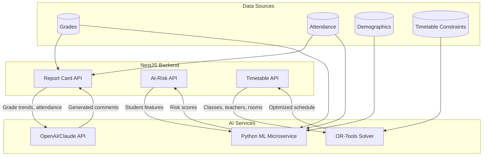

# V2.2: AI-Powered Workflows

## Overview

Leverage AI/ML to automate tedious tasks and provide predictive insights. This includes LLM-generated report card comments, a Python-based ML microservice for dropout prediction, and constraint satisfaction for timetable generation.




---

## Phase 1: Smart Report Card Comments

### 1.1 LLM Integration Service

**File:** `server/src/ai/ai.module.ts`

Create a new AI module for LLM interactions.

**File:** `server/src/ai/ai.service.ts`

```typescript
@Injectable()
export class AiService {
  private openai: OpenAI;

  constructor(private config: ConfigService) {
    this.openai = new OpenAI({
      apiKey: this.config.get('OPENAI_API_KEY'),
    });
  }

  async generateReportComment(context: StudentReportContext): Promise<string> {
    const prompt = this.buildCommentPrompt(context);
    
    const response = await this.openai.chat.completions.create({
      model: 'gpt-4o-mini',
      messages: [
        { role: 'system', content: REPORT_CARD_SYSTEM_PROMPT },
        { role: 'user', content: prompt },
      ],
      max_tokens: 200,
      temperature: 0.7,
    });

    return response.choices[0].message.content;
  }

  private buildCommentPrompt(context: StudentReportContext): string {
    return `Generate a personalized report card comment for:
Student: ${context.studentName}
Class Rank: ${context.rank} of ${context.totalStudents}
Average Score: ${context.average}%
Grade Trend: ${context.trend} (improving/stable/declining)
Attendance Rate: ${context.attendanceRate}%
Strongest Subject: ${context.strongestSubject}
Needs Improvement: ${context.weakestSubject}

Write a constructive, encouraging 2-3 sentence comment.`;
  }
}

const REPORT_CARD_SYSTEM_PROMPT = `You are a helpful assistant generating report card comments for a Ghanaian school. 
Comments should be:
- Encouraging and constructive
- Specific to the student's performance
- Written in formal British English
- 2-3 sentences maximum
- Appropriate for parents to read`;
```

### 1.2 Report Card Enhancement

**File:** `server/src/reports/reports.service.ts`

Add method to generate AI comments:

```typescript
async generateStudentReport(studentId: string, termId: string) {
  const data = await this.getStudentReportData(studentId, termId);
  
  // Calculate context for AI
  const context: StudentReportContext = {
    studentName: data.student.name,
    rank: data.summary.rank,
    totalStudents: data.summary.totalInClass,
    average: data.summary.average,
    trend: this.calculateTrend(data.results),
    attendanceRate: data.attendance.percentage,
    strongestSubject: this.getStrongestSubject(data.results),
    weakestSubject: this.getWeakestSubject(data.results),
  };

  const aiComment = await this.aiService.generateReportComment(context);
  
  return { ...data, aiComment };
}
```

### 1.3 Frontend: Comment Preview

**File:** `client/src/app/(dashboard)/dashboard/reports/[studentId]/page.tsx`

Add AI comment section with edit capability:

```typescript
// Show AI-generated comment with option to edit before finalizing
<Card>
  <CardHeader>
    <CardTitle>Teacher's Comment</CardTitle>
    <Badge variant="secondary">AI Generated</Badge>
  </CardHeader>
  <CardContent>
    <Textarea 
      value={comment} 
      onChange={(e) => setComment(e.target.value)}
      placeholder="Loading AI comment..."
    />
    <Button onClick={regenerateComment}>Regenerate</Button>
  </CardContent>
</Card>
```

---

## Phase 2: Predictive Retention Analytics (ML Pipeline)

### 2.1 Python Microservice Architecture

```
ml-service/
├── app/
│   ├── main.py           # FastAPI entry point
│   ├── models/
│   │   └── dropout_model.py
│   ├── features/
│   │   └── feature_engineering.py
│   └── api/
│       └── routes.py
├── models/
│   └── dropout_classifier.pkl
├── requirements.txt
└── Dockerfile
```

### 2.2 Feature Engineering

**File:** `ml-service/app/features/feature_engineering.py`

```python
def extract_student_features(student_data: dict) -> np.ndarray:
    """Extract ML features from student data."""
    return np.array([
        student_data['attendance_rate'],
        student_data['average_grade'],
        student_data['grade_trend'],  # slope of grades over time
        student_data['absence_streak'],  # max consecutive absences
        student_data['late_count'],
        student_data['fee_payment_status'],  # 0=overdue, 1=partial, 2=paid
        student_data['parent_engagement'],  # login frequency
        student_data['days_since_enrollment'],
    ])
```

### 2.3 ML Model Training

**File:** `ml-service/app/models/dropout_model.py`

```python
from sklearn.ensemble import GradientBoostingClassifier
from sklearn.model_selection import train_test_split
import joblib

class DropoutPredictor:
    def __init__(self):
        self.model = GradientBoostingClassifier(
            n_estimators=100,
            max_depth=5,
            random_state=42
        )
    
    def train(self, X: np.ndarray, y: np.ndarray):
        X_train, X_test, y_train, y_test = train_test_split(
            X, y, test_size=0.2, random_state=42
        )
        self.model.fit(X_train, y_train)
        accuracy = self.model.score(X_test, y_test)
        return {'accuracy': accuracy}
    
    def predict_risk(self, features: np.ndarray) -> dict:
        proba = self.model.predict_proba(features)[0]
        return {
            'risk_score': float(proba[1]),
            'risk_level': 'HIGH' if proba[1] > 0.7 else 'MEDIUM' if proba[1] > 0.4 else 'LOW',
            'contributing_factors': self._get_factors(features)
        }
    
    def _get_factors(self, features: np.ndarray) -> list:
        # Use SHAP or feature importance to explain prediction
        importance = self.model.feature_importances_
        factor_names = ['attendance', 'grades', 'trend', 'absences', 'lateness', 
                        'fees', 'parent_engagement', 'tenure']
        factors = sorted(zip(factor_names, importance), key=lambda x: -x[1])
        return [f[0] for f in factors[:3]]
```

### 2.4 FastAPI Endpoints

**File:** `ml-service/app/main.py`

```python
from fastapi import FastAPI
from pydantic import BaseModel

app = FastAPI(title="Lanita ML Service")

class StudentFeatures(BaseModel):
    student_id: str
    attendance_rate: float
    average_grade: float
    grade_trend: float
    absence_streak: int
    late_count: int
    fee_payment_status: int
    parent_engagement: float
    days_since_enrollment: int

@app.post("/predict/dropout-risk")
async def predict_dropout_risk(data: StudentFeatures):
    features = extract_student_features(data.dict())
    prediction = predictor.predict_risk(features)
    return {
        "student_id": data.student_id,
        **prediction
    }

@app.post("/predict/batch")
async def predict_batch(students: list[StudentFeatures]):
    results = []
    for student in students:
        features = extract_student_features(student.dict())
        prediction = predictor.predict_risk(features)
        results.append({"student_id": student.student_id, **prediction})
    return results
```

### 2.5 NestJS Integration

**File:** `server/src/analytics/analytics.service.ts`

```typescript
async getAtRiskStudentsML(): Promise<AtRiskStudent[]> {
  // Fetch all active students with their features
  const students = await this.prisma.studentRecord.findMany({
    include: {
      user: { include: { profile: true } },
      attendance: true,
      results: true,
      invoices: true,
    },
  });

  // Extract features and call ML service
  const features = students.map(s => this.extractFeatures(s));
  
  const mlResponse = await this.httpService.post(
    `${this.config.get('ML_SERVICE_URL')}/predict/batch`,
    features
  ).toPromise();

  return mlResponse.data
    .filter(r => r.risk_level !== 'LOW')
    .sort((a, b) => b.risk_score - a.risk_score);
}
```

### 2.6 Docker Compose Update

**File:** `docker-compose.yml`

```yaml
services:
  ml-service:
    build: ./ml-service
    container_name: lanita-ml
    ports:
      - "5000:5000"
    environment:
      - MODEL_PATH=/app/models/dropout_classifier.pkl
    volumes:
      - ./ml-service/models:/app/models
```

---

## Phase 3: Smart Timetabling

### 3.1 Timetable Data Models

**File:** `server/prisma/schema.prisma`

```prisma
model TimetableSlot {
  id          String   @id @default(uuid()) @db.Uuid
  dayOfWeek   Int      // 0-4 (Mon-Fri)
  periodNumber Int     // 1-8
  startTime   String   // "08:00"
  endTime     String   // "08:45"
  sectionId   String   @db.Uuid
  subjectId   String   @db.Uuid
  teacherId   String   @db.Uuid
  roomId      String?  @db.Uuid
  
  section     Section  @relation(...)
  subject     Subject  @relation(...)
  teacher     User     @relation(...)
  room        Room?    @relation(...)
  
  @@unique([dayOfWeek, periodNumber, sectionId])
  @@unique([dayOfWeek, periodNumber, teacherId])
  @@unique([dayOfWeek, periodNumber, roomId])
}

model Room {
  id       String @id @default(uuid()) @db.Uuid
  name     String
  capacity Int
  type     RoomType // CLASSROOM, LAB, HALL
  slots    TimetableSlot[]
}

enum RoomType {
  CLASSROOM
  LAB
  HALL
}
```

### 3.2 OR-Tools Python Solver

**File:** `ml-service/app/timetable/solver.py`

```python
from ortools.sat.python import cp_model

class TimetableSolver:
    def __init__(self, data: TimetableInput):
        self.data = data
        self.model = cp_model.CpModel()
        self.slots = {}  # (section, day, period) -> subject assignment
    
    def solve(self) -> TimetableSolution:
        self._create_variables()
        self._add_constraints()
        
        solver = cp_model.CpSolver()
        solver.parameters.max_time_in_seconds = 60
        status = solver.Solve(self.model)
        
        if status in [cp_model.OPTIMAL, cp_model.FEASIBLE]:
            return self._extract_solution(solver)
        return None
    
    def _add_constraints(self):
        # 1. Each section has each subject the required times per week
        # 2. No teacher teaches two classes at the same time
        # 3. No room double-booked
        # 4. Lab subjects must be in lab rooms
        # 5. Consecutive periods for double-period subjects
        pass
```

### 3.3 Timetable API

**File:** `ml-service/app/api/timetable_routes.py`

```python
@router.post("/timetable/generate")
async def generate_timetable(input_data: TimetableInput):
    solver = TimetableSolver(input_data)
    solution = solver.solve()
    
    if solution is None:
        raise HTTPException(400, "No feasible timetable found")
    
    return {
        "status": "success",
        "slots": solution.slots,
        "conflicts_resolved": solution.conflicts_resolved,
        "optimization_score": solution.score
    }
```

### 3.4 Frontend: Timetable Generator

**File:** `client/src/app/(dashboard)/admin/timetable/page.tsx`

- Input: Select academic year, term
- Configure: Periods per day, subjects per week requirements
- Generate: Call solver API
- Review: Grid view of generated timetable
- Edit: Manual adjustments with conflict detection
- Save: Persist to database

---

## Environment Variables

```env
# AI Services
OPENAI_API_KEY=sk-...
ML_SERVICE_URL=http://ml-service:5000

# Optional: Use Claude instead
ANTHROPIC_API_KEY=sk-ant-...
```

---

## File Structure Summary

```
server/
└── src/
    ├── ai/
    │   ├── ai.module.ts
    │   └── ai.service.ts
    ├── analytics/
    │   └── analytics.service.ts (update)
    └── timetable/
        ├── timetable.module.ts
        ├── timetable.controller.ts
        └── timetable.service.ts

ml-service/
├── app/
│   ├── main.py
│   ├── models/
│   │   └── dropout_model.py
│   ├── features/
│   │   └── feature_engineering.py
│   ├── timetable/
│   │   └── solver.py
│   └── api/
│       ├── routes.py
│       └── timetable_routes.py
├── models/
│   └── dropout_classifier.pkl
├── requirements.txt
└── Dockerfile

client/
└── src/app/(dashboard)/
    ├── dashboard/reports/[studentId]/page.tsx (update)
    └── admin/timetable/page.tsx (new)
```

---

## Dependencies

**NestJS:**

```bash
npm install openai @anthropic-ai/sdk axios
```

**Python ML Service:**

```txt
fastapi==0.104.0
uvicorn==0.24.0
scikit-learn==1.3.2
pandas==2.1.3
numpy==1.26.2
joblib==1.3.2
ortools==9.8.3296
shap==0.43.0
```

