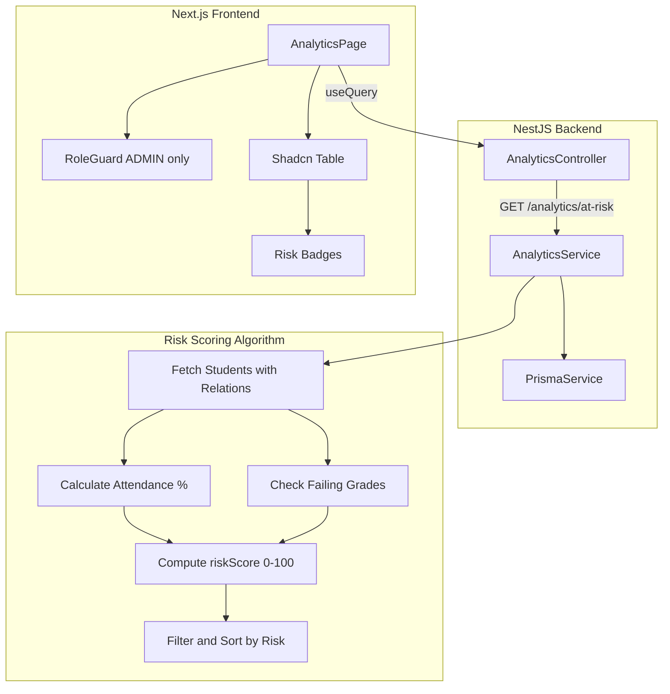

# At-Risk Analytics Module Implementation

## Architecture Overview




---

## Part 1: Backend - Analytics Module

### 1.1 Create Module Files

Create three files manually in `server/src/analytics/`:

- `analytics.module.ts`
- `analytics.service.ts`
- `analytics.controller.ts`

### 1.2 Analytics Service (`server/src/analytics/analytics.service.ts`)

**Method:** `getAtRiskStudents()`

**Data Gathering Query:**

```typescript
const students = await this.prisma.studentRecord.findMany({
  include: {
    user: { include: { profile: true } },
    currentSection: { include: { class: true } },
    attendance: {
      where: {
        date: { gte: startOfCurrentTerm, lte: new Date() }
      }
    },
    results: {
      include: { subject: true, exam: true },
      orderBy: { createdAt: 'desc' },
      take: 10
    }
  }
});
```

**Risk Scoring Algorithm:**

For each student:

1. **Attendance Factor:**
  - Calculate: `attendancePercentage = (presentCount / totalRecords) * 100`
  - If `< 70%`: add 50 points
  - Else if `< 85%`: add 30 points
  - Add risk factor: "Low Attendance (X%)"
2. **Academic Factor:**
  - For each result with `score < 50`:
    - Add 15 points
    - If subject is "Mathematics" or "English": add extra 10 points
    - Add risk factor: "Failing {Subject}"
3. **Filter and Sort:**
  - Filter students where `riskScore > 0`
  - Sort descending by `riskScore`

**Return Type:**

```typescript
interface AtRiskStudent {
  studentId: string;
  name: string;
  admissionNumber: string;
  className: string;
  sectionName: string;
  riskScore: number;
  riskFactors: string[];
}
```

### 1.3 Analytics Controller (`server/src/analytics/analytics.controller.ts`)

**Route:** `GET /analytics/at-risk`

```typescript
@Controller('analytics')
@UseGuards(AuthGuard('jwt'), RolesGuard)
export class AnalyticsController {
  @Get('at-risk')
  @Roles(UserRole.ADMIN, UserRole.SUPER_ADMIN)
  getAtRiskStudents() {
    return this.analyticsService.getAtRiskStudents();
  }
}
```

### 1.4 Register Module

Update [server/src/app.module.ts](server/src/app.module.ts) to import `AnalyticsModule`.

---

## Part 2: Frontend - Analytics Page

### 2.1 Create Page

**File:** `client/src/app/(dashboard)/admin/analytics/page.tsx`

### 2.2 Data Fetching

```typescript
const { data: atRiskStudents, isLoading } = useQuery({
  queryKey: ['analytics', 'at-risk'],
  queryFn: () => api.get('/analytics/at-risk').then(res => res.data)
});
```

### 2.3 UI Components

**Layout:**

- Header with `ShieldAlert` icon and title "Predictive Attrition & Intervention"
- Shadcn Table with columns: Avatar/Name, Admission No, Class, Risk Score, Risk Factors, Actions

**Risk Score Badge Colors:**

- `>= 75`: Red Badge ("Critical Risk")
- `50-74`: Yellow/Orange Badge ("High Risk")
- `< 50`: Gray Badge ("Monitor")

**Risk Factors:** Map array to small secondary badges

**Action Column:** "Schedule Meeting" button with placeholder toast

### 2.4 Access Control

Wrap page content in `RoleGuard allowedRoles={["ADMIN", "SUPER_ADMIN"]}`

### 2.5 Update Sidebar Navigation

Add to `adminNavigation` array in [client/src/components/sidebar.tsx](client/src/components/sidebar.tsx):

```typescript
{
  name: "Analytics",
  href: "/admin/analytics",
  icon: ShieldAlert,
}
```

---

## Files to Create/Modify


| Action | File                                                  |
| ------ | ----------------------------------------------------- |
| Create | `server/src/analytics/analytics.module.ts`            |
| Create | `server/src/analytics/analytics.service.ts`           |
| Create | `server/src/analytics/analytics.controller.ts`        |
| Modify | `server/src/app.module.ts`                            |
| Create | `client/src/app/(dashboard)/admin/analytics/page.tsx` |
| Modify | `client/src/components/sidebar.tsx`                   |


