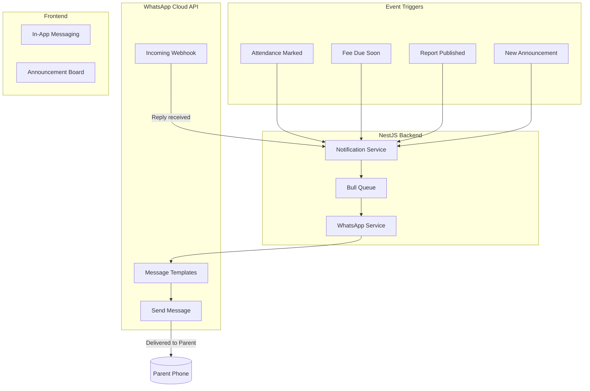

# V2.3: Communication & Engagement (WhatsApp)

## Overview

WhatsApp is the dominant messaging platform in Ghana. Instead of SMS, we'll integrate with WhatsApp Business API for automated notifications. This includes attendance alerts, fee reminders, report card notifications, plus in-app messaging and announcements.




---

## Phase 1: WhatsApp Business API Setup

### 1.1 Prerequisites (School Admin Tasks)

1. Create Meta Business Account at business.facebook.com
2. Set up WhatsApp Business Account
3. Add phone number and verify
4. Create message templates (require Meta approval)
5. Generate permanent access token

### 1.2 Required Message Templates

Templates must be pre-approved by Meta. Create these in the WhatsApp Business Manager:


| Template Name      | Category | Content                                                                                                                |
| ------------------ | -------- | ---------------------------------------------------------------------------------------------------------------------- |
| `attendance_alert` | UTILITY  | "Hello {{1}}, your child {{2}} was marked {{3}} today ({{4}}). Contact the school if this is incorrect."               |
| `fee_reminder`     | UTILITY  | "Hello {{1}}, a reminder that {{2}}'s school fees of GHS {{3}} for {{4}} is due on {{5}}. Current balance: GHS {{6}}." |
| `fee_overdue`      | UTILITY  | "Hello {{1}}, {{2}}'s school fees of GHS {{3}} is now overdue. Please make payment to avoid service interruption."     |
| `report_ready`     | UTILITY  | "Hello {{1}}, {{2}}'s report card for {{3}} is now available. Log in to the parent portal to view: {{4}}"              |
| `announcement`     | UTILITY  | "{{1}} School Announcement: {{2}}"                                                                                     |


---

## Phase 2: Database Schema Updates

### 2.1 Notification Models

**File:** `server/prisma/schema.prisma`

```prisma
model NotificationLog {
  id            String              @id @default(uuid()) @db.Uuid
  recipientId   String              @db.Uuid
  recipientType RecipientType       // PARENT, TEACHER, STUDENT
  channel       NotificationChannel // WHATSAPP, EMAIL, IN_APP
  templateName  String?
  content       String
  status        NotificationStatus  @default(PENDING)
  whatsappMsgId String?             // WhatsApp message ID for tracking
  sentAt        DateTime?
  deliveredAt   DateTime?
  readAt        DateTime?
  errorMessage  String?
  createdAt     DateTime            @default(now())
  
  recipient     User                @relation(fields: [recipientId], references: [id])
}

model Message {
  id          String      @id @default(uuid()) @db.Uuid
  threadId    String      @db.Uuid
  senderId    String      @db.Uuid
  content     String
  isRead      Boolean     @default(false)
  createdAt   DateTime    @default(now())
  
  thread      MessageThread @relation(fields: [threadId], references: [id])
  sender      User          @relation(fields: [senderId], references: [id])
}

model MessageThread {
  id           String    @id @default(uuid()) @db.Uuid
  participantA String    @db.Uuid  // Teacher
  participantB String    @db.Uuid  // Parent
  studentId    String    @db.Uuid  // Context: which child
  lastMessageAt DateTime @default(now())
  createdAt    DateTime  @default(now())
  
  messages     Message[]
  userA        User      @relation("ThreadParticipantA", fields: [participantA], references: [id])
  userB        User      @relation("ThreadParticipantB", fields: [participantB], references: [id])
  student      StudentRecord @relation(fields: [studentId], references: [id])
  
  @@unique([participantA, participantB, studentId])
}

model Announcement {
  id          String             @id @default(uuid()) @db.Uuid
  title       String
  content     String
  scope       AnnouncementScope  // SCHOOL_WIDE, CLASS, SECTION
  scopeId     String?            @db.Uuid  // classId or sectionId if scoped
  authorId    String             @db.Uuid
  isPinned    Boolean            @default(false)
  publishAt   DateTime           @default(now())
  expiresAt   DateTime?
  createdAt   DateTime           @default(now())
  updatedAt   DateTime           @updatedAt
  
  author      User               @relation(fields: [authorId], references: [id])
}

enum NotificationChannel {
  WHATSAPP
  EMAIL
  IN_APP
}

enum NotificationStatus {
  PENDING
  SENT
  DELIVERED
  READ
  FAILED
}

enum RecipientType {
  PARENT
  TEACHER
  STUDENT
}

enum AnnouncementScope {
  SCHOOL_WIDE
  CLASS
  SECTION
}
```

---

## Phase 3: WhatsApp Integration Service

### 3.1 WhatsApp Service

**File:** `server/src/notifications/whatsapp.service.ts`

```typescript
@Injectable()
export class WhatsAppService {
  private readonly apiUrl = 'https://graph.facebook.com/v18.0';
  private readonly phoneNumberId: string;
  private readonly accessToken: string;

  constructor(private config: ConfigService, private http: HttpService) {
    this.phoneNumberId = this.config.get('WHATSAPP_PHONE_NUMBER_ID');
    this.accessToken = this.config.get('WHATSAPP_ACCESS_TOKEN');
  }

  async sendTemplate(
    to: string,
    templateName: string,
    languageCode: string = 'en',
    components: TemplateComponent[] = [],
  ): Promise<WhatsAppResponse> {
    const url = `${this.apiUrl}/${this.phoneNumberId}/messages`;
    
    const payload = {
      messaging_product: 'whatsapp',
      to: this.formatPhoneNumber(to),
      type: 'template',
      template: {
        name: templateName,
        language: { code: languageCode },
        components,
      },
    };

    try {
      const response = await this.http.post(url, payload, {
        headers: {
          'Authorization': `Bearer ${this.accessToken}`,
          'Content-Type': 'application/json',
        },
      }).toPromise();

      return {
        success: true,
        messageId: response.data.messages[0].id,
      };
    } catch (error) {
      return {
        success: false,
        error: error.response?.data?.error?.message || error.message,
      };
    }
  }

  private formatPhoneNumber(phone: string): string {
    // Ensure Ghana format: 233XXXXXXXXX
    let cleaned = phone.replace(/\D/g, '');
    if (cleaned.startsWith('0')) {
      cleaned = '233' + cleaned.slice(1);
    }
    if (!cleaned.startsWith('233')) {
      cleaned = '233' + cleaned;
    }
    return cleaned;
  }
}
```

### 3.2 Notification Service

**File:** `server/src/notifications/notification.service.ts`

```typescript
@Injectable()
export class NotificationService {
  constructor(
    private prisma: PrismaService,
    private whatsapp: WhatsAppService,
    @InjectQueue('notifications') private notificationQueue: Queue,
  ) {}

  async sendAttendanceAlert(
    parentId: string,
    studentName: string,
    status: AttendanceStatus,
    date: string,
  ) {
    const parent = await this.prisma.user.findUnique({
      where: { id: parentId },
      include: { profile: true },
    });

    if (!parent?.profile?.contactNumber) return;

    await this.notificationQueue.add('send-whatsapp', {
      recipientId: parentId,
      phone: parent.profile.contactNumber,
      templateName: 'attendance_alert',
      components: [
        {
          type: 'body',
          parameters: [
            { type: 'text', text: parent.profile.firstName },
            { type: 'text', text: studentName },
            { type: 'text', text: status.toLowerCase() },
            { type: 'text', text: date },
          ],
        },
      ],
    });
  }

  async sendFeeReminder(
    parentId: string,
    studentName: string,
    amount: number,
    term: string,
    dueDate: string,
    balance: number,
  ) {
    // Similar implementation...
  }

  async sendReportReadyNotification(
    parentId: string,
    studentName: string,
    term: string,
    portalUrl: string,
  ) {
    // Similar implementation...
  }
}
```

### 3.3 Queue Processor

**File:** `server/src/notifications/notification.processor.ts`

```typescript
@Processor('notifications')
export class NotificationProcessor {
  constructor(
    private prisma: PrismaService,
    private whatsapp: WhatsAppService,
  ) {}

  @Process('send-whatsapp')
  async handleWhatsAppNotification(job: Job<WhatsAppJobData>) {
    const { recipientId, phone, templateName, components } = job.data;

    // Create log entry
    const log = await this.prisma.notificationLog.create({
      data: {
        recipientId,
        recipientType: 'PARENT',
        channel: 'WHATSAPP',
        templateName,
        content: JSON.stringify(components),
        status: 'PENDING',
      },
    });

    // Send via WhatsApp
    const result = await this.whatsapp.sendTemplate(
      phone,
      templateName,
      'en',
      components,
    );

    // Update log
    await this.prisma.notificationLog.update({
      where: { id: log.id },
      data: {
        status: result.success ? 'SENT' : 'FAILED',
        whatsappMsgId: result.messageId,
        sentAt: result.success ? new Date() : null,
        errorMessage: result.error,
      },
    });
  }
}
```

### 3.4 Webhook Handler

**File:** `server/src/notifications/notification.controller.ts`

```typescript
@Controller('webhooks')
export class WebhookController {
  @Post('whatsapp')
  async handleWhatsAppWebhook(@Body() body: any, @Res() res: Response) {
    // Verify webhook (required by Meta)
    if (body.object === 'whatsapp_business_account') {
      for (const entry of body.entry) {
        for (const change of entry.changes) {
          if (change.field === 'messages') {
            await this.processStatusUpdate(change.value);
          }
        }
      }
    }
    return res.sendStatus(200);
  }

  @Get('whatsapp')
  verifyWebhook(@Query() query: any, @Res() res: Response) {
    // Meta webhook verification
    const verifyToken = this.config.get('WHATSAPP_VERIFY_TOKEN');
    if (query['hub.verify_token'] === verifyToken) {
      return res.send(query['hub.challenge']);
    }
    return res.sendStatus(403);
  }
}
```

---

## Phase 4: In-App Messaging

### 4.1 Messaging Service

**File:** `server/src/messaging/messaging.service.ts`

```typescript
@Injectable()
export class MessagingService {
  async getOrCreateThread(
    teacherId: string,
    parentId: string,
    studentId: string,
  ): Promise<MessageThread> {
    return this.prisma.messageThread.upsert({
      where: {
        participantA_participantB_studentId: {
          participantA: teacherId,
          participantB: parentId,
          studentId,
        },
      },
      create: {
        participantA: teacherId,
        participantB: parentId,
        studentId,
      },
      update: {},
      include: { messages: { take: 50, orderBy: { createdAt: 'desc' } } },
    });
  }

  async sendMessage(threadId: string, senderId: string, content: string) {
    const message = await this.prisma.message.create({
      data: { threadId, senderId, content },
    });

    await this.prisma.messageThread.update({
      where: { id: threadId },
      data: { lastMessageAt: new Date() },
    });

    // Optionally send WhatsApp notification for new message
    return message;
  }

  async getThreadsForUser(userId: string) {
    return this.prisma.messageThread.findMany({
      where: {
        OR: [{ participantA: userId }, { participantB: userId }],
      },
      include: {
        userA: { include: { profile: true } },
        userB: { include: { profile: true } },
        student: { include: { user: { include: { profile: true } } } },
        messages: { take: 1, orderBy: { createdAt: 'desc' } },
      },
      orderBy: { lastMessageAt: 'desc' },
    });
  }
}
```

### 4.2 Messaging Controller

**File:** `server/src/messaging/messaging.controller.ts`

```typescript
@ApiTags('Messaging')
@ApiBearerAuth()
@Controller('messaging')
@UseGuards(AuthGuard('jwt'), RolesGuard)
export class MessagingController {
  @Get('threads')
  @Roles(UserRole.TEACHER, UserRole.PARENT)
  getThreads(@Request() req) {
    return this.messagingService.getThreadsForUser(req.user.sub);
  }

  @Get('threads/:threadId')
  @Roles(UserRole.TEACHER, UserRole.PARENT)
  getThread(@Param('threadId') threadId: string) {
    return this.messagingService.getThreadMessages(threadId);
  }

  @Post('threads/:threadId/messages')
  @Roles(UserRole.TEACHER, UserRole.PARENT)
  sendMessage(
    @Param('threadId') threadId: string,
    @Body() dto: SendMessageDto,
    @Request() req,
  ) {
    return this.messagingService.sendMessage(threadId, req.user.sub, dto.content);
  }

  @Post('threads')
  @Roles(UserRole.TEACHER)
  createThread(@Body() dto: CreateThreadDto, @Request() req) {
    return this.messagingService.getOrCreateThread(
      req.user.sub,
      dto.parentId,
      dto.studentId,
    );
  }
}
```

### 4.3 Frontend: Messaging UI

**File:** `client/src/app/(dashboard)/messages/page.tsx`

- Thread list sidebar
- Message conversation view
- Compose new message (teacher only)
- Real-time updates with React Query polling or WebSocket

---

## Phase 5: Announcement Board

### 5.1 Announcement Service

**File:** `server/src/announcements/announcements.service.ts`

```typescript
@Injectable()
export class AnnouncementsService {
  async create(dto: CreateAnnouncementDto, authorId: string) {
    const announcement = await this.prisma.announcement.create({
      data: { ...dto, authorId },
    });

    // Notify via WhatsApp if enabled
    if (dto.notifyWhatsApp) {
      await this.notifyRecipients(announcement);
    }

    return announcement;
  }

  async getForUser(userId: string, role: UserRole) {
    const user = await this.prisma.user.findUnique({
      where: { id: userId },
      include: {
        studentRecord: { include: { currentSection: true } },
        children: { include: { currentSection: true } },
      },
    });

    const classIds = this.getRelevantClassIds(user, role);
    const sectionIds = this.getRelevantSectionIds(user, role);

    return this.prisma.announcement.findMany({
      where: {
        OR: [
          { scope: 'SCHOOL_WIDE' },
          { scope: 'CLASS', scopeId: { in: classIds } },
          { scope: 'SECTION', scopeId: { in: sectionIds } },
        ],
        publishAt: { lte: new Date() },
        OR: [{ expiresAt: null }, { expiresAt: { gt: new Date() } }],
      },
      include: { author: { include: { profile: true } } },
      orderBy: [{ isPinned: 'desc' }, { publishAt: 'desc' }],
    });
  }
}
```

### 5.2 Frontend: Announcement Board

**File:** `client/src/app/(dashboard)/announcements/page.tsx`

- List of announcements with badges (Pinned, New)
- Filter by scope (All, Class, Section)
- Admin: Create/Edit announcement form
- Rich text content with markdown support

---

## Phase 6: Automated Triggers

### 6.1 Attendance Trigger

**File:** `server/src/attendance/attendance.service.ts`

```typescript
async markBatchAttendance(dto: BatchAttendanceDto) {
  // ... existing logic ...

  // Trigger WhatsApp notifications for absences
  for (const record of dto.records) {
    if (record.status === 'ABSENT' || record.status === 'LATE') {
      const student = await this.prisma.studentRecord.findUnique({
        where: { id: record.studentId },
        include: {
          parent: { include: { profile: true } },
          user: { include: { profile: true } },
        },
      });

      if (student?.parent) {
        await this.notificationService.sendAttendanceAlert(
          student.parent.id,
          `${student.user.profile.firstName} ${student.user.profile.lastName}`,
          record.status,
          dto.date,
        );
      }
    }
  }
}
```

### 6.2 Fee Reminder Cron Job

**File:** `server/src/billing/billing.scheduler.ts`

```typescript
@Injectable()
export class BillingScheduler {
  @Cron('0 9 * * 1') // Every Monday at 9 AM
  async sendWeeklyFeeReminders() {
    const upcomingDue = await this.prisma.studentInvoice.findMany({
      where: {
        status: { in: ['PENDING', 'PARTIAL'] },
        dueDate: {
          gte: new Date(),
          lte: new Date(Date.now() + 7 * 24 * 60 * 60 * 1000),
        },
      },
      include: {
        student: {
          include: {
            parent: { include: { profile: true } },
            user: { include: { profile: true } },
          },
        },
        term: true,
      },
    });

    for (const invoice of upcomingDue) {
      if (invoice.student.parent) {
        await this.notificationService.sendFeeReminder(...);
      }
    }
  }
}
```

---

## Environment Variables

```env
# WhatsApp Business API
WHATSAPP_PHONE_NUMBER_ID=1234567890
WHATSAPP_ACCESS_TOKEN=EAAG...
WHATSAPP_VERIFY_TOKEN=your-verify-token
WHATSAPP_BUSINESS_ACCOUNT_ID=9876543210

# Redis for Bull Queue
REDIS_URL=redis://localhost:6379
```

---

## File Structure

```
server/src/
├── notifications/
│   ├── notifications.module.ts
│   ├── notification.service.ts
│   ├── notification.processor.ts
│   ├── notification.controller.ts (webhooks)
│   └── whatsapp.service.ts
├── messaging/
│   ├── messaging.module.ts
│   ├── messaging.service.ts
│   ├── messaging.controller.ts
│   └── dto/
├── announcements/
│   ├── announcements.module.ts
│   ├── announcements.service.ts
│   ├── announcements.controller.ts
│   └── dto/
└── billing/
    └── billing.scheduler.ts

client/src/app/(dashboard)/
├── messages/
│   └── page.tsx
└── announcements/
    └── page.tsx
```

---

## Dependencies

```bash
# NestJS
npm install @nestjs/bull bull @nestjs/schedule

# Redis (for queue)
# Add to docker-compose.yml
```

