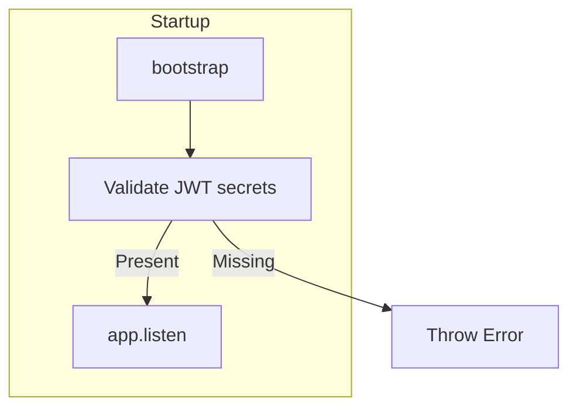

# CRITICAL-1: JWT Fallback Secret Remediation

## Problem

When `JWT_ACCESS_SECRET` or `JWT_REFRESH_SECRET` is unset, the app must not fall back to known defaults (e.g. `fallback-secret`). An attacker who knows these defaults could forge valid tokens and bypass authentication.

## Current State

| File | Current Code | Issue |
|------|--------------|-------|
| [server/src/auth/strategies/accessToken.strategy.ts](server/src/auth/strategies/accessToken.strategy.ts) | `config.get<string>('JWT_ACCESS_SECRET')!` | No fallback; uses non-null assertion. If undefined, passport-jwt receives undefined. |
| [server/src/auth/strategies/refreshToken.strategy.ts](server/src/auth/strategies/refreshToken.strategy.ts) | `config.get<string>('JWT_REFRESH_SECRET')!` | Same as above. |
| [server/src/auth/auth.service.ts](server/src/auth/auth.service.ts) | `config.get<string>('JWT_ACCESS_SECRET')` and `config.get<string>('JWT_REFRESH_SECRET')` | No fallback; `jwtService.signAsync` would receive undefined. |
| [server/src/auth/auth.module.ts](server/src/auth/auth.module.ts) | `secret: config.get<string>('JWT_ACCESS_SECRET')` | No fallback. |
| [server/src/main.ts](server/src/main.ts) | Lines 56-66: Throws if secrets missing in production | Production validation exists; development does not validate. |

The strategies and auth module do not currently use fallbacks. The main.ts validates only when `NODE_ENV === 'production'`. In development, missing secrets could cause cryptic runtime errors rather than a clear startup failure.

## Implementation Plan

### 1. Add startup validation in main.ts (extend for all environments)

In [server/src/main.ts](server/src/main.ts), before `app.listen()`, validate JWT secrets in all environments:

```ts
const accessSecret = configService.get<string>('JWT_ACCESS_SECRET');
const refreshSecret = configService.get<string>('JWT_REFRESH_SECRET');
if (!accessSecret || !refreshSecret) {
  throw new Error(
    'JWT_ACCESS_SECRET and JWT_REFRESH_SECRET must be set. ' +
    'Add them to your .env file. See .env.example for reference.'
  );
}
```

Remove the `NODE_ENV === 'production'` guard so the server fails at startup in both environments when secrets are missing.

### 2. Verify no fallbacks in strategies

In [server/src/auth/strategies/accessToken.strategy.ts](server/src/auth/strategies/accessToken.strategy.ts) and [server/src/auth/strategies/refreshToken.strategy.ts](server/src/auth/strategies/refreshToken.strategy.ts):

- Confirm no `|| 'fallback-secret'` or similar. Current code uses `!` only.
- No code changes required if fallbacks are absent; startup validation will ensure secrets exist before strategies are used.

### 3. Verify auth.service.ts and auth.module.ts

- [server/src/auth/auth.service.ts](server/src/auth/auth.service.ts): `getTokens()` uses `accessSecret` and `refreshSecret` directly. No fallback. No change needed.
- [server/src/auth/auth.module.ts](server/src/auth/auth.module.ts): JwtModule uses `config.get<string>('JWT_ACCESS_SECRET')`. No fallback. No change needed.

### 4. Update .env.example

Ensure [.env.example](.env.example) documents that `JWT_ACCESS_SECRET` and `JWT_REFRESH_SECRET` are required and must be strong random values in production. Add a note that the server will not start without them.

## Verification

- Run server with secrets unset: should fail at startup with clear error.
- Run server with secrets set: should start and auth should work.
- Run existing auth tests to ensure no regressions.

## Data Flow



## Files to Modify

| Action | File |
|--------|------|
| Modify | [server/src/main.ts](server/src/main.ts) - validate JWT secrets for all environments |
| Modify | [.env.example](.env.example) - document required secrets |

## Audit Backlog Update

After implementation, update [docs/AUDIT-REMEDIATION-BACKLOG.md](docs/AUDIT-REMEDIATION-BACKLOG.md):
- CRITICAL-1: Set Status to `[x] Done`, Plan to link to this plan file.
