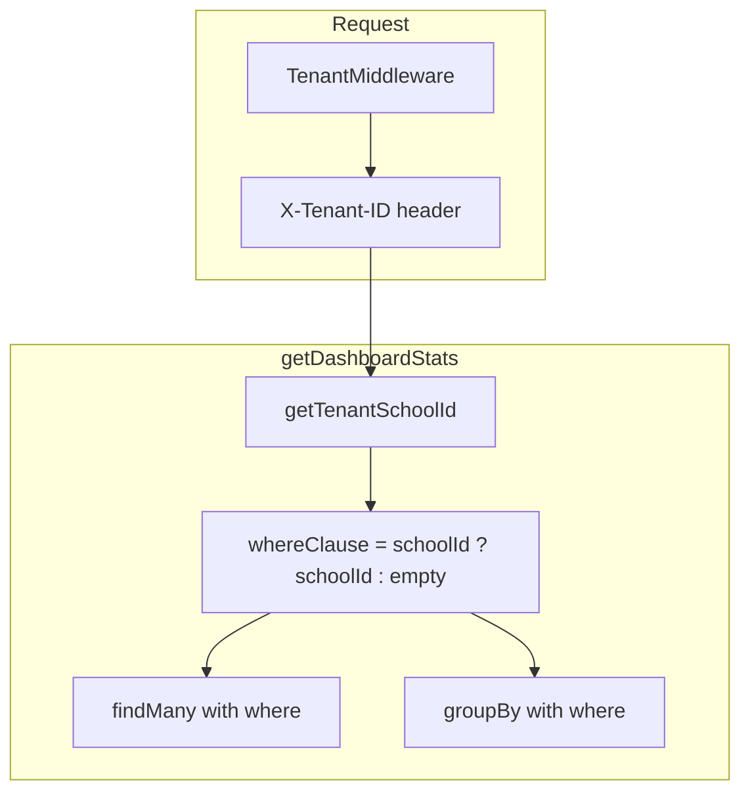

# CRITICAL-2: Billing groupBy Tenant Leak Remediation

## Problem

In `getDashboardStats()`, the Prisma tenant extension applies to `findMany()` but **not** to `groupBy()`. The tenant extension only overrides `findMany`, `findFirst`, `findUnique`, `create`, `update`, `delete`, etc.—it does not override `groupBy`. As a result, `groupBy({ by: ['status'], _count: { status: true } })` with no `where` clause returns counts across **all tenants**, causing:

- Wrong dashboard stats for admins
- Cross-tenant data leak in multi-tenant deployments

## Current State (Fixed)

The fix has been applied in [server/src/billing/billing.service.ts](server/src/billing/billing.service.ts):

```ts
async getDashboardStats() {
  const schoolId = getTenantSchoolId();
  const whereClause = schoolId ? { schoolId } : {};

  const invoices = await this.prisma.studentInvoice.findMany({
    where: whereClause,
  });
  // ...
  const statusCounts = await this.prisma.studentInvoice.groupBy({
    where: whereClause,
    by: ['status'],
    _count: { status: true },
  });
  // ...
}
```

Both `findMany` and `groupBy` now use `where: whereClause` when `getTenantSchoolId()` returns a value. When no tenant context exists (e.g. single-tenant or legacy), `whereClause` is `{}` and behavior is unchanged.

## Implementation Plan (Verification)

### 1. Verify the fix is present

In [server/src/billing/billing.service.ts](server/src/billing/billing.service.ts), confirm:

- `getTenantSchoolId()` is called and `whereClause` is built
- `findMany` uses `where: whereClause`
- `groupBy` uses `where: whereClause`

### 2. Ensure getTenantSchoolId is imported

The billing service must import `getTenantSchoolId` from [server/src/common/tenant/tenant.context.ts](server/src/common/tenant/tenant.context.ts). Verify the import exists.

### 3. Update audit backlog

In [docs/AUDIT-REMEDIATION-BACKLOG.md](docs/AUDIT-REMEDIATION-BACKLOG.md):

- CRITICAL-2: Set Status to `[x] Done`
- Plan: Link to this plan file (e.g. `.cursor/plans/critical-2_billing_groupby_tenant_*.plan.md`)

## Data Flow




## Verification

- In multi-tenant mode: Call `GET /billing/stats` with different `X-Tenant-ID` values; counts should differ per tenant.
- In single-tenant mode: Stats should reflect only that tenant's invoices.
- Run billing-related tests to ensure no regressions.

## Files Modified


| File                                                                           | Change                                                       |
| ------------------------------------------------------------------------------ | ------------------------------------------------------------ |
| [server/src/billing/billing.service.ts](server/src/billing/billing.service.ts) | Add `whereClause` and apply to both `findMany` and `groupBy` |
| [docs/AUDIT-REMEDIATION-BACKLOG.md](docs/AUDIT-REMEDIATION-BACKLOG.md)         | Update CRITICAL-2 status and plan link                       |


## Optional: Memory Optimization (Future)

The audit suggested avoiding loading all invoices into memory. The current implementation uses `findMany` and reduces in JavaScript. For very large datasets, consider:

- Using `aggregate` or raw SQL for totals instead of `findMany` + reduce
- Adding pagination or caps for dashboard stats

This is out of scope for the critical fix; the tenant leak is resolved.