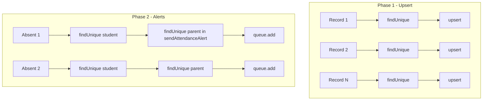
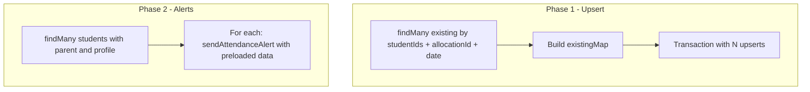

# HIGH-1: Attendance Batch N+1 and Per-Record Notifications Remediation

## Problem

In [server/src/attendance/attendance.service.ts](server/src/attendance/attendance.service.ts), `markRegister()` has two N+1 patterns:

1. **Phase 1 (lines 29-81):** `Promise.all(records.map(...))` does one `findUnique` plus one `upsert` per record (2N queries).
2. **Phase 2 (lines 86-112):** For each ABSENT/LATE record, one `studentRecord.findUnique` and one `sendAttendanceAlert` call. `sendAttendanceAlert` does another `user.findUnique` for the parent (2N more queries for absent/late students).

**Impact:** Performance degrades with large classes; unnecessary DB and notification load.

## Current Flow




## Implementation Plan

### 1. Bulk-load existing attendance (Phase 1)

Replace per-record `findUnique` with a single `findMany`:

```ts
const existingRecords = await this.prisma.attendanceRecord.findMany({
  where: {
    allocationId: subjectAllocationId,
    date: attendanceDate,
    studentId: { in: records.map((r) => r.studentId) },
  },
});
const existingMap = new Map(
  existingRecords.map((r) => [`${r.studentId}-${r.allocationId}-${r.date.toISOString()}`, r])
);
```

Use `existingMap` inside the loop to check `existingRecord` and offline sync logic instead of querying.

### 2. Batch upserts in a transaction (Phase 1)

Wrap all upserts in `prisma.$transaction([...])`. Prisma does not support bulk upsert natively, so keep individual `upsert` calls but run them in a single transaction to reduce round-trips. The transaction ensures atomicity and batches the work.

```ts
const upsertOps = records
  .filter((record) => {
    const key = `${record.studentId}-${subjectAllocationId}-${attendanceDate.toISOString()}`;
    const existing = existingMap.get(key);
    if (existing && offlineTimestamp && existing.updatedAt.getTime() >= offlineTimestamp) {
      return false; // skip
    }
    return true;
  })
  .map((record) =>
    this.prisma.attendanceRecord.upsert({ where: {...}, update: {...}, create: {...} })
  );
await this.prisma.$transaction(upsertOps);
```

### 3. Bulk-load students and parents for alerts (Phase 2)

Replace the per-record `studentRecord.findUnique` loop with one query:

```ts
const absentLateStudentIds = records
  .filter((r) => r.status === AttendanceStatus.ABSENT || r.status === AttendanceStatus.LATE)
  .map((r) => r.studentId);

if (absentLateStudentIds.length > 0) {
  const students = await this.prisma.studentRecord.findMany({
    where: { id: { in: absentLateStudentIds } },
    include: {
      parent: { include: { profile: true } },
      user: { include: { profile: true } },
    },
  });

  for (const student of students) {
    if (!student.parent?.profile?.contactNumber) continue;
    const studentName = `${student.user.profile?.firstName || ''} ${student.user.profile?.lastName || ''}`.trim() || 'Your child';
    await this.notificationService.sendAttendanceAlert(
      student.parent.id,
      studentName,
      records.find((r) => r.studentId === student.id)!.status,
      attendanceDate.toISOString().split('T')[0],
    );
  }
}
```

This removes N `studentRecord.findUnique` calls. The `sendAttendanceAlert` still does a `user.findUnique` for the parent—we can either:

- **Option A:** Add `sendAttendanceAlertFromParent(parent, studentName, status, date)` that skips the parent fetch when parent data is already available.
- **Option B:** Add `sendAttendanceAlertBatch(entries: Array<{parentId, studentName, status, date, phone?}>)` that bulk-loads parents and enqueues all jobs.

**Recommendation:** Option A—add an overload or optional param to skip the parent fetch when the caller has already loaded parent data. Pass `contactNumber` or a flag to avoid the extra query.

### 4. Refactor NotificationService.sendAttendanceAlert (optional but recommended)

In [server/src/notifications/notification.service.ts](server/src/notifications/notification.service.ts), add an overload or optional parameter:

```ts
async sendAttendanceAlert(
  parentId: string,
  studentName: string,
  status: AttendanceStatus,
  date: string,
  options?: { phone?: string; parentFirstName?: string }
) {
  let phone = options?.phone;
  let parentFirstName = options?.parentFirstName;

  if (!phone || !parentFirstName) {
    const parent = await this.prisma.user.findUnique({
      where: { id: parentId },
      include: { profile: true },
    });
    if (!parent?.profile?.contactNumber) return;
    phone = parent.profile.contactNumber;
    parentFirstName = parent.profile.firstName ?? '';
  }
  // ... rest of queue.add using phone and parentFirstName
}
```

The attendance service then passes `{ phone: parent.profile.contactNumber, parentFirstName: parent.profile.firstName }` when calling from the bulk-loaded loop, avoiding the extra query.

## Data Flow (After Fix)




## Files to Modify


| File                                                                                                 | Changes                                                                                                                                      |
| ---------------------------------------------------------------------------------------------------- | -------------------------------------------------------------------------------------------------------------------------------------------- |
| [server/src/attendance/attendance.service.ts](server/src/attendance/attendance.service.ts)           | Bulk-load existing attendance; batch upsert in transaction; bulk-load students for alerts; pass preloaded parent data to sendAttendanceAlert |
| [server/src/notifications/notification.service.ts](server/src/notifications/notification.service.ts) | Add optional `options` param to `sendAttendanceAlert` to accept preloaded phone/parentFirstName and skip parent fetch                        |


## Verification

- Run existing attendance tests.
- Manually test `POST /attendance/batch` with a class of 30+ students; verify DB query count is reduced (e.g. use logging or a DB profiler).
- Verify attendance alerts still send for absent/late students.

## Audit Backlog Update

After implementation, update [docs/AUDIT-REMEDIATION-BACKLOG.md](docs/AUDIT-REMEDIATION-BACKLOG.md):

- HIGH-1: Set Status to `[x] Done`, Plan to link to this plan file.

