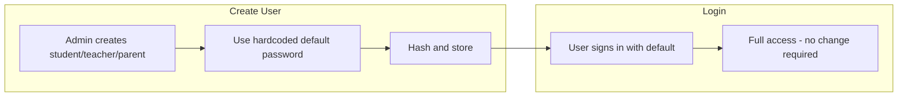
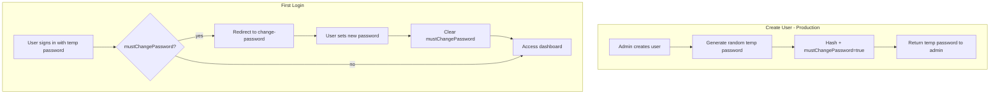

# HIGH-3: Default Passwords in Production Remediation

## Problem

New students, teachers, and parents are created with hardcoded default passwords (`Student@123`, `Teacher@123`, `Parent@123`) in:

- [server/src/students/students.service.ts](server/src/students/students.service.ts) (line 52)
- [server/src/teachers/teachers.service.ts](server/src/teachers/teachers.service.ts) (line 100)
- [server/src/parents/parents.service.ts](server/src/parents/parents.service.ts) (line 17)

Acceptable for seed/demo; in production there is no "change password on first login" or one-time link flow. If these defaults are used in production, accounts are easily guessable.

**Impact:** Production accounts are vulnerable to credential guessing; no mechanism to force password change.

## Current Flow




## Implementation Plan

### 1. Add `mustChangePassword` to User model

Add a boolean field to track users who must change their password on first login:

```prisma
model User {
  // ... existing fields
  mustChangePassword Boolean @default(false)
  // ...
}
```

Create a migration: `npx prisma migrate dev --name add_must_change_password`

### 2. Create shared password utility

In [server/src/common/utils/password.utils.ts](server/src/common/utils/password.utils.ts) (new file):

```ts
import * as crypto from 'crypto';
import * as argon2 from 'argon2';

const DEFAULT_PASSWORDS = {
  STUDENT: 'Student@123',
  TEACHER: 'Teacher@123',
  PARENT: 'Parent@123',
} as const;

export function generateTemporaryPassword(): string {
  const chars = 'ABCDEFGHJKLMNPQRSTUVWXYZabcdefghjkmnpqrstuvwxyz23456789';
  const bytes = crypto.randomBytes(12);
  let result = '';
  for (let i = 0; i < 12; i++) {
    result += chars[bytes[i] % chars.length];
  }
  return result + '1!'; // Ensure complexity requirement
}

export function getInitialPassword(
  role: 'STUDENT' | 'TEACHER' | 'PARENT',
  isProduction: boolean,
): { password: string; mustChange: boolean } {
  if (isProduction) {
    return {
      password: generateTemporaryPassword(),
      mustChange: true,
    };
  }
  return {
    password: DEFAULT_PASSWORDS[role],
    mustChange: false,
  };
}
```

### 3. Update students.service.ts

- Import `getInitialPassword` and `ConfigService` (or check `process.env.NODE_ENV`)
- Replace `const defaultPassword = 'Student@123'` with:

```ts
const { password, mustChange } = getInitialPassword(
  'STUDENT',
  process.env.NODE_ENV === 'production',
);
const passwordHash = await argon2.hash(password);
```

- In `tx.user.create`, add `mustChangePassword: mustChange`

### 4. Update teachers.service.ts

Same pattern: use `getInitialPassword('TEACHER', ...)` and set `mustChangePassword: mustChange` on user create.

### 5. Update parents.service.ts

Same pattern: use `getInitialPassword('PARENT', ...)` and set `mustChangePassword: mustChange` on user create.

### 6. Return temporary password in create response (production only)

When `mustChange: true`, the admin needs to communicate the password to the user (e.g. printed slip, secure handoff). Options:

- **Option A:** Include `temporaryPassword` in the API response only when `mustChange` is true. The admin UI displays it once (e.g. modal) and instructs the user to change on first login. **Recommended**—simplest; no email infra needed.
- **Option B:** Send via email/WhatsApp—requires notification integration and template.

**Recommendation:** Option A. Add `temporaryPassword?: string` to create response DTOs when in production and mustChange is true. Document that this is shown once and the user must change on first login.

### 7. Auth: Include `mustChangePassword` in signin response

In [server/src/auth/auth.service.ts](server/src/auth/auth.service.ts) `signin()`:

- After successful auth, fetch `user.mustChangePassword` (or include in initial findFirst)
- Return `{ accessToken, refreshToken, mustChangePassword: user.mustChangePassword }`

### 8. Add change-password endpoint

In [server/src/auth/auth.controller.ts](server/src/auth/auth.controller.ts) and [server/src/auth/auth.service.ts](server/src/auth/auth.service.ts):

```ts
// POST /auth/change-password
// Body: { currentPassword: string, newPassword: string }
// Requires AuthGuard('jwt')
```

- Verify `currentPassword` matches `user.passwordHash`
- Hash and update `passwordHash`
- Set `mustChangePassword: false`
- Return success

### 9. Frontend: Change password on first login

- In [client/src/app/(auth)/login/page.tsx](client/src/app/(auth)/login/page.tsx) or auth flow: if `mustChangePassword` is true in signin response, redirect to `/change-password` instead of dashboard
- Create [client/src/app/(auth)/change-password/page.tsx](client/src/app/(auth)/change-password/page.tsx): form with current password (pre-filled or hidden if coming from first-login) and new password. Call `POST /auth/change-password`, then redirect to dashboard.
- For first-login flow: user knows their temp password, so "current password" = temp password. No special handling needed—same endpoint works.

### 10. Optional: Guard protected routes

Add a guard or middleware that checks `mustChangePassword` on the user. If true and request is not to `/auth/change-password`, return 403 with `{ code: 'PASSWORD_CHANGE_REQUIRED' }`. Frontend redirects to change-password page. This prevents users from bypassing the change-password screen.

## Data Flow (After Fix)




## Files to Modify


| File                                                                                             | Changes                                                                          |
| ------------------------------------------------------------------------------------------------ | -------------------------------------------------------------------------------- |
| [server/prisma/schema.prisma](server/prisma/schema.prisma)                                       | Add `mustChangePassword Boolean @default(false)` to User                         |
| [server/src/common/utils/password.utils.ts](server/src/common/utils/password.utils.ts)           | New: `generateTemporaryPassword`, `getInitialPassword`                           |
| [server/src/students/students.service.ts](server/src/students/students.service.ts)               | Use `getInitialPassword`, set `mustChangePassword`, return temp password in prod |
| [server/src/teachers/teachers.service.ts](server/src/teachers/teachers.service.ts)               | Same                                                                             |
| [server/src/parents/parents.service.ts](server/src/parents/parents.service.ts)                   | Same                                                                             |
| [server/src/auth/auth.service.ts](server/src/auth/auth.service.ts)                               | Include `mustChangePassword` in signin; add `changePassword` method              |
| [server/src/auth/auth.controller.ts](server/src/auth/auth.controller.ts)                         | Add `POST /auth/change-password`                                                 |
| [server/src/auth/dto/auth-dto.ts](server/src/auth/dto/auth-dto.ts)                               | Add `ChangePasswordDto`                                                          |
| [client/src/app/(auth)/login/page.tsx](client/src/app/(auth)/login/page.tsx)                     | Redirect to change-password when `mustChangePassword`                            |
| [client/src/app/(auth)/change-password/page.tsx](client/src/app/(auth)/change-password/page.tsx) | New: change password form                                                        |


## Verification

- **Dev:** Create student/teacher/parent; default passwords still work; no mustChangePassword.
- **Production (NODE_ENV=production):** Create user; random password returned; signin returns mustChangePassword; change-password flow works; subsequent signin has mustChangePassword=false.
- Run existing tests; add unit tests for `getInitialPassword` and change-password flow.

## Audit Backlog Update

After implementation, update [docs/AUDIT-REMEDIATION-BACKLOG.md](docs/AUDIT-REMEDIATION-BACKLOG.md):

- HIGH-3: Set Status to `[x] Done`
- Plan: Link to this plan file

