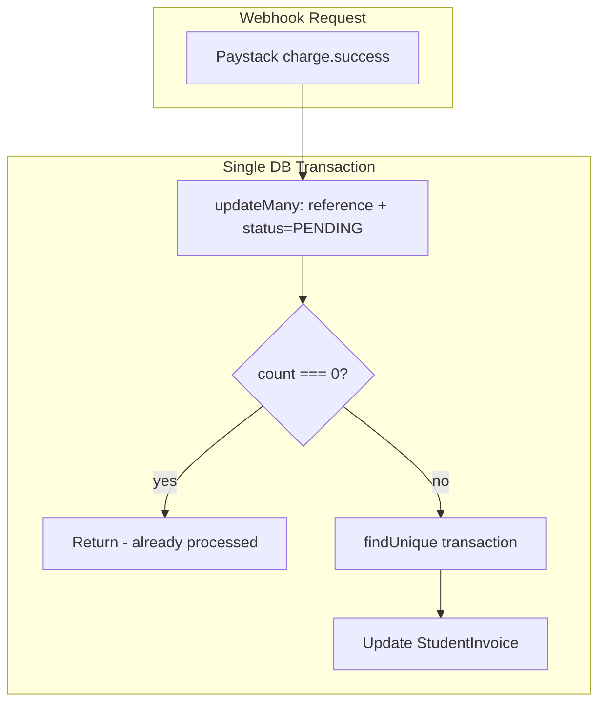

# HIGH-4: Paystack Webhook Idempotency

## Problem Summary

Paystack retries webhooks (every 3 min for 4 attempts, then hourly for up to 72 hours in live mode). If `processChargeSuccess` is slow or fails after a partial DB update, a retry could double-apply the payment. The current early-return when `transaction.status === SUCCESS` runs outside the transaction, creating a race window where two concurrent webhooks could both pass the check and double-credit.

## Root Cause

- [billing.service.ts](server/src/billing/billing.service.ts) lines 442-474: `processChargeSuccess` checks `transaction.status === SUCCESS` before starting the transaction
- Between the check and the `$transaction` block, a concurrent webhook could process the same reference
- Both handlers could then update the invoice, resulting in double credit

## Solution

Use an **atomic conditional update** as the idempotency gate: only update `PaymentTransaction` when `status` is still `PENDING`. If the update affects 0 rows, another handler already processed it—return without touching the invoice.

## Implementation Plan

### 1. Refactor processChargeSuccess for atomic idempotency

**File:** [server/src/billing/billing.service.ts](server/src/billing/billing.service.ts)

Replace the current flow with:

1. **Single transaction** wrapping the entire flow
2. **Atomic claim**: Use `updateMany` with `where: { reference, status: 'PENDING' }` and `data: { status: 'SUCCESS', channel }`
3. **Idempotency gate**: If `result.count === 0`, return immediately (already processed by another webhook or previous retry)
4. **Invoice update**: Only when `count === 1`, fetch the transaction (now SUCCESS) and update the invoice

```ts
async processChargeSuccess(reference: string, channel: string): Promise<void> {
  await this.prisma.$transaction(async (tx) => {
    const txResult = await tx.paymentTransaction.updateMany({
      where: { reference, status: 'PENDING' },
      data: { status: PaymentTransactionStatus.SUCCESS, channel },
    });
    if (txResult.count === 0) return; // Idempotent: already processed

    const transaction = await tx.paymentTransaction.findUnique({
      where: { reference },
      include: { invoice: true },
    });
    if (!transaction) return;

    const invoice = transaction.invoice;
    const newAmountPaid = invoice.amountPaid.add(transaction.amount);
    const newStatus = newAmountPaid.greaterThanOrEqualTo(invoice.totalAmount)
      ? InvoiceStatus.PAID
      : InvoiceStatus.PARTIAL;

    await tx.studentInvoice.update({
      where: { id: invoice.id },
      data: { amountPaid: newAmountPaid, status: newStatus },
    });
  });
}
```

**Why this works:** `updateMany` with `status: 'PENDING'` is atomic. Only the first webhook (or retry) will match a row; subsequent retries will match 0 rows and exit without updating the invoice.

### 2. Webhook controller: preserve current behavior

**File:** [server/src/billing/paystack-webhook.controller.ts](server/src/billing/paystack-webhook.controller.ts)

No changes required. The controller already:

- Validates signature before processing
- Catches errors from `processChargeSuccess` and logs them
- Returns `{ received: true }` (200) after handling

**Optional improvement:** Return 200 immediately and process asynchronously (e.g. via Bull queue) to avoid timeout-triggered retries. This is out of scope for HIGH-4; the audit fix focuses on idempotency.

### 3. Document retry behavior

Add a brief comment above `processChargeSuccess` documenting:

- Paystack may retry webhooks; this method is idempotent
- The `reference` (Paystack transaction ref) is the idempotency key
- Double delivery cannot double-credit due to the atomic `updateMany` gate

### 4. Handle missing transaction

The current code returns silently when `transaction` is not found. Keep this behavior: an unknown reference may be from another system or a malformed webhook; we should not throw (which would cause 500 and trigger Paystack retries for a reference we cannot process).

## Data Flow




## Files to Modify

- [server/src/billing/billing.service.ts](server/src/billing/billing.service.ts) — Refactor `processChargeSuccess` to use atomic `updateMany` as idempotency gate and wrap full flow in a single transaction

## Verification

- Unit test: Call `processChargeSuccess(reference, channel)` twice with the same reference; assert invoice `amountPaid` increases only once
- Manual: Trigger a Paystack test webhook twice with the same reference; verify no double credit in DB

