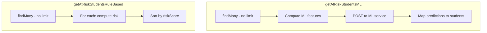
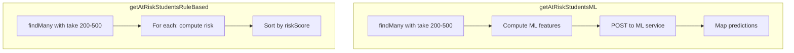

# HIGH-5: Analytics Unbounded Load Remediation

## Problem

In [server/src/analytics/analytics.service.ts](server/src/analytics/analytics.service.ts), `getAtRiskStudentsML()` (lines 154-171) and `getAtRiskStudentsRuleBased()` (lines 246-258) use `studentRecord.findMany({ include: { ... } })` with no `take` or pagination. For large schools this loads and serializes the entire student set; tenant scope is applied by the Prisma extension but volume is unbounded.

**Impact:** Slow or memory-heavy requests; risk of timeouts or OOM.

## Current Flow




## Implementation Plan

### 1. Add constants and query params

In [server/src/analytics/analytics.service.ts](server/src/analytics/analytics.service.ts), add:

```ts
const DEFAULT_AT_RISK_LIMIT = 200;
const MAX_AT_RISK_LIMIT = 500;
```

Create [server/src/analytics/dto/at-risk-query.dto.ts](server/src/analytics/dto/at-risk-query.dto.ts):

```ts
export class AtRiskQueryDto {
  @IsOptional()
  @Type(() => Number)
  @IsInt()
  @Min(1)
  @Max(500)
  limit?: number = 200;

  @IsOptional()
  @Type(() => Number)
  @IsInt()
  @Min(1)
  page?: number = 1;
}
```

### 2. Apply cap to getAtRiskStudentsML

In `getAtRiskStudentsML()`:

- Accept optional `limit` and `page` (or a single `limit` for the initial fix)
- Add `take: Math.min(limit ?? DEFAULT_AT_RISK_LIMIT, MAX_AT_RISK_LIMIT)` to the `findMany` call
- Add `orderBy: { enrollmentDate: 'desc' }` to prioritize recent students (proxy for "current term")
- The ML service receives a bounded batch; no changes needed to the ML call itself

### 3. Apply cap to getAtRiskStudentsRuleBased

In `getAtRiskStudentsRuleBased()`:

- Same `take` and `orderBy` as ML path
- Ensures both code paths are bounded

### 4. Update getAtRiskStudents and controller

- `getAtRiskStudents(useML, limit?, page?)` passes limit/page to the underlying methods
- [server/src/analytics/analytics.controller.ts](server/src/analytics/analytics.controller.ts): Add `@Query() query: AtRiskQueryDto` and pass `query.limit` to the service

### 5. Optional: Return pagination meta

If the client may request pagination, return `PaginatedResult<AtRiskStudent>` with a `count` query for total students. For a minimal fix, returning a capped array is sufficient; the client continues to work without changes.

**Recommendation for minimal fix:** Add `take` and `orderBy` only. No pagination DTO or response shape change. The client receives up to 500 at-risk students. Document that for schools with more students, results are capped.

### 6. Add explicit tenant filter (defense in depth)

Although the Prisma tenant extension applies to `StudentRecord`, add an explicit `where: { schoolId: getTenantSchoolId() }` when `schoolId` is present, matching the pattern in [server/src/billing/billing.service.ts](server/src/billing/billing.service.ts). This ensures correct behavior if the extension is bypassed or misconfigured.

### 7. Update audit backlog

In [docs/AUDIT-REMEDIATION-BACKLOG.md](docs/AUDIT-REMEDIATION-BACKLOG.md):

- HIGH-5: Set Status to `[x] Done`
- Plan: Link to this plan file

## Data Flow (After Fix)




## Files to Modify


| File                                                                                           | Changes                                                                                     |
| ---------------------------------------------------------------------------------------------- | ------------------------------------------------------------------------------------------- |
| [server/src/analytics/analytics.service.ts](server/src/analytics/analytics.service.ts)         | Add constants; add `take` and `orderBy` to both findMany; add optional `where` for schoolId |
| [server/src/analytics/analytics.controller.ts](server/src/analytics/analytics.controller.ts)   | Add optional `limit` query param; pass to service                                           |
| [server/src/analytics/dto/at-risk-query.dto.ts](server/src/analytics/dto/at-risk-query.dto.ts) | New: optional limit validation                                                              |
| [docs/AUDIT-REMEDIATION-BACKLOG.md](docs/AUDIT-REMEDIATION-BACKLOG.md)                         | Update HIGH-5 status and plan link                                                          |


## Verification

- Call `GET /analytics/at-risk` with a school that has 1000+ students; response should contain at most 500 items.
- Call with `?limit=50`; response should contain at most 50 items.
- Run existing analytics tests; add unit test for capped behavior.

## Future Enhancements (Out of Scope)

- Move heavy ML call to a background job and cache results per tenant/term
- Add pagination UI on the client for schools with many at-risk students
- Scope to current academic term when schema supports it cleanly

