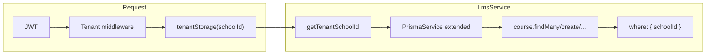

# LMS Course and CourseModule REST APIs

## Current state

- **Prisma schema** ([server/prisma/schema.prisma](server/prisma/schema.prisma)): No `Course` or `CourseModule` models. Multi-tenancy is done with `schoolId` on tenant-scoped models.
- **Tenant isolation**: [server/src/common/tenant/tenant.context.ts](server/src/common/tenant/tenant.context.ts) exposes `getTenantSchoolId()`. [server/src/prisma/prisma-tenant.extension.ts](server/src/prisma/prisma-tenant.extension.ts) auto-injects `schoolId` into all Prisma queries for models listed in `TENANT_MODELS`. New models must be added there (and have `schoolId`) to get automatic filtering.
- **LMS**: No `server/src/lms` folder or LmsModule yet; all LMS code will be new.
- **Patterns**: DTOs use `class-validator` (see [server/src/subjects/dto/create-subject.dto.ts](server/src/subjects/dto/create-subject.dto.ts)); controllers use `AuthGuard('jwt')`, `RolesGuard`, and `@Roles()` (e.g. [server/src/subjects/subjects.controller.ts](server/src/subjects/subjects.controller.ts)); PrismaService exposes delegates via getters ([server/src/prisma/prisma.service.ts](server/src/prisma/prisma.service.ts))—new delegates must be added after schema change.

**Note:** You asked for filtering by `tenantId`; this codebase uses **schoolId** for tenant isolation. The plan keeps that: every query will be scoped by the active tenant’s `schoolId` (via the tenant extension and/or explicit `where: { schoolId }` where needed).

---

## 1. Prisma schema: add Course and CourseModule

In [server/prisma/schema.prisma](server/prisma/schema.prisma):

- **Course**
  - Fields: `id`, `schoolId`, `subjectId`, `teacherId` (optional), `name`, `code` (optional), `description` (optional), `academicYearId` (optional), `createdAt`, `updatedAt`.
  - Relations: `school` (School), `subject` (Subject), `teacher` (User), `academicYear` (AcademicYear, optional), `modules` (CourseModule[]).
  - Unique: `@@unique([schoolId, code])` if code is required; otherwise omit or keep optional.
  - Index: `@@index([schoolId])`.
- **CourseModule**
  - Fields: `id`, `schoolId`, `courseId`, `title`, `description` (optional), `order` (Int, default 0), `createdAt`, `updatedAt`.
  - Relations: `school` (School), `course` (Course).
  - Indexes: `@@index([schoolId])`, `@@index([courseId])`.

Add the inverse relations on `School`, `Subject`, `User`, and `AcademicYear` as needed. Then run `npx prisma generate` (and migrate if you use migrations).

---

## 2. Tenant extension and PrismaService

- In [server/src/prisma/prisma-tenant.extension.ts](server/src/prisma/prisma-tenant.extension.ts): add `'Course'` and `'CourseModule'` to `TENANT_MODELS` so all find/create/update/delete are automatically scoped by `schoolId`.
- In [server/src/prisma/prisma.service.ts](server/src/prisma/prisma.service.ts): add getters `course` and `courseModule` that delegate to the extended client (same pattern as `subject`, `class`, etc.).

---

## 3. DTOs (class-validator)

Create under `server/src/lms/dto/`:

- **create-course.dto.ts**
  - `name: string` (required), `code?: string`, `description?: string`, `subjectId: string` (UUID), `teacherId?: string` (UUID), `academicYearId?: string` (UUID). Use `@IsString()`, `@IsNotEmpty()`, `@IsOptional()`, `@IsUUID()`.
- **create-module.dto.ts**
  - `title: string` (required), `description?: string`, `order?: number`. Use `@IsString()`, `@IsNotEmpty()`, `@IsOptional()`, `@IsInt()`, `@Min(0)`.

---

## 4. LmsService ([server/src/lms/lms.service.ts](server/src/lms/lms.service.ts))

- **createCourse(dto)**  
`this.prisma.course.create({ data: dto })`. Relies on tenant extension to set `schoolId`; no need to pass it manually.
- **findAllCourses()**  
`this.prisma.course.findMany({ include: { subject: true, teacher: true }, orderBy: { name: 'asc' } })`. Extension adds `schoolId` to `where`.
- **findOneCourse(id)**  
`this.prisma.course.findUnique({ where: { id }, include: { modules: true } })`. Extension adds `schoolId` to `where` so only courses for the current tenant are returned.
- **createCourseModule(courseId, dto)**  
  - Ensure the course belongs to the current tenant: e.g. `findUnique` the course by `id` (extension already scopes by schoolId). If not found, throw `NotFoundException`.
  - Then `this.prisma.courseModule.create({ data: { ...dto, courseId } })`. Extension will set `schoolId` on the new module.

All queries use the extended Prisma client; no need to pass `tenantId` explicitly—**tenant isolation is enforced by the Prisma tenant extension** via `schoolId` for `Course` and `CourseModule`.

---

## 5. LmsController ([server/src/lms/lms.controller.ts](server/src/lms/lms.controller.ts))

- Base: `@Controller('lms')`, `@UseGuards(AuthGuard('jwt'))`, `@ApiTags('LMS')`, `@ApiBearerAuth()`.
- **POST /lms/courses** — `create(@Body() dto: CreateCourseDto)` → `lmsService.createCourse(dto)`. Restrict to appropriate roles (e.g. ADMIN, SUPER_ADMIN) with `@UseGuards(RolesGuard)` and `@Roles(...)`.
- **GET /lms/courses** — `findAll()` → `lmsService.findAllCourses()`.
- **GET /lms/courses/:id** — `findOne(@Param('id') id)` → `lmsService.findOneCourse(id)`; throw `NotFoundException` if service returns null.
- **POST /lms/courses/:courseId/modules** — `createModule(@Param('courseId') courseId, @Body() dto: CreateModuleDto)` → `lmsService.createCourseModule(courseId, dto)`; handle 404 when course not found.

Use `ParseUUIDPipe` for `:id` and `:courseId` where appropriate.

---

## 6. LmsModule and app registration

- **lms.module.ts**: Create [server/src/lms/lms.module.ts](server/src/lms/lms.module.ts) importing `PrismaModule`; declare `LmsController` and `LmsService`.
- **app.module.ts**: Import and register `LmsModule` in `imports`.

---

## 7. Data flow (tenant isolation)

The tenant middleware (or auth pipeline) sets the tenant context; `getTenantSchoolId()` is used inside the Prisma extension to inject `schoolId` into every query for `Course` and `CourseModule`, so no manual `tenantId` is required in service code.

---

## File summary

| Action | File                                                                                                                                     |
| ------ | ---------------------------------------------------------------------------------------------------------------------------------------- |
| Edit   | [server/prisma/schema.prisma](server/prisma/schema.prisma) — add Course, CourseModule, relations                                         |
| Edit   | [server/src/prisma/prisma-tenant.extension.ts](server/src/prisma/prisma-tenant.extension.ts) — add Course, CourseModule to TENANT_MODELS |
| Edit   | [server/src/prisma/prisma.service.ts](server/src/prisma/prisma.service.ts) — add course, courseModule getters                            |
| Create | [server/src/lms/dto/create-course.dto.ts](server/src/lms/dto/create-course.dto.ts)                                                       |
| Create | [server/src/lms/dto/create-module.dto.ts](server/src/lms/dto/create-module.dto.ts)                                                       |
| Create | [server/src/lms/lms.service.ts](server/src/lms/lms.service.ts)                                                                           |
| Create | [server/src/lms/lms.controller.ts](server/src/lms/lms.controller.ts)                                                                     |
| Create | [server/src/lms/lms.module.ts](server/src/lms/lms.module.ts)                                                                             |
| Edit   | [server/src/app.module.ts](server/src/app.module.ts) — import LmsModule                                                                  |

After schema changes: run `npx prisma generate` (and create/apply migration if applicable).