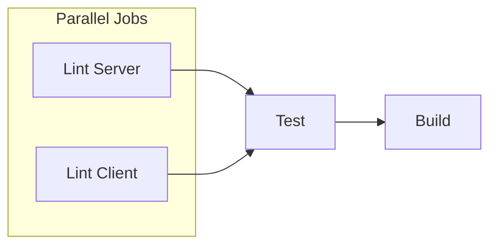

# MEDIUM-1: No Client Lint/Build in CI

## Problem Summary

CI runs only server lint, tests, and build. The client (Next.js) is not linted or built in the pipeline, so frontend regressions can reach production.

## Root Cause

- [.github/workflows/ci-cd.yml](.github/workflows/ci-cd.yml): The `lint` job runs only `npm run lint` in `server/`
- The `build` job builds only the server
- No job touches the `client/` directory

## Solution

Add a `client-lint` job that installs client dependencies, runs ESLint, and ideally runs `next build` to catch compilation errors.

## Implementation Plan

### 1. Add client-lint job

**File:** [.github/workflows/ci-cd.yml](.github/workflows/ci-cd.yml)

Add a new job that runs in parallel with the existing `lint` job (no `needs`):

```yaml
client-lint:
  name: Lint Client
  runs-on: ubuntu-latest
  steps:
    - uses: actions/checkout@v4

    - name: Setup Node.js
      uses: actions/setup-node@v4
      with:
        node-version: ${{ env.NODE_VERSION }}
        cache: 'npm'
        cache-dependency-path: client/package-lock.json

    - name: Install dependencies (client)
      run: npm ci
      working-directory: client

    - name: Lint client
      run: npm run lint
      working-directory: client

    - name: Build client
      run: npm run build
      working-directory: client
```

**Cache note:** If `client/package-lock.json` does not exist, either:

- Run `npm install` in `client/` locally and commit the generated `package-lock.json`, or
- Use `npm install` instead of `npm ci` in the job and omit `cache-dependency-path` (or use a path that exists)

### 2. Handle missing package-lock.json

The project `.gitignore` lists `package-lock.json`, but the server CI references `server/package-lock.json`—so lock files may be committed in subdirectories. Verify whether `client/package-lock.json` exists:

- **If it exists:** Use `npm ci` and `cache-dependency-path: client/package-lock.json` as above.
- **If it does not:** Use `npm install` instead of `npm ci`, and remove or adjust the `cache-dependency-path` for the client job (setup-node will skip cache if the path is missing).

### 3. Wire client-lint into the pipeline

- **Option A (recommended):** Run `client-lint` in parallel with `lint` (no `needs`). Update `test` to `needs: [lint, client-lint]` so both must pass before tests run.
- **Option B:** Run `client-lint` after `lint` with `needs: lint`—simpler but slower.

### 4. Optional: Add client build to main build job

The `build` job (main branch only) currently builds only the server. For consistency, add a client build step:

```yaml
- name: Build client
  run: npm run build
  working-directory: client
```

This ensures the production build includes a verified client build.

## Data Flow




## Files to Modify

- [.github/workflows/ci-cd.yml](.github/workflows/ci-cd.yml) — Add `client-lint` job; update `test` job `needs` to include `client-lint`; optionally add client build to `build` job

## Verification

- Push a branch with a lint error in `client/src` (e.g. unused variable) and confirm the `client-lint` job fails
- Push a branch with a TypeScript/build error in the client and confirm the job fails
- Ensure `test` and `build` jobs still pass when client-lint passes

