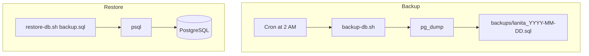

# MEDIUM-2: Database Backup Strategy Remediation

## Problem

No pg_dump, cron, or restore procedure documented or implemented. For beta/production, at least daily backups and a tested restore are needed.

**Impact:** Data loss risk with no recovery path.

## Current State

- PostgreSQL 16 runs in Docker ([docker-compose.yml](docker-compose.yml) `db` service)
- Data persisted in `postgres_data` volume
- Production deploys to VPS via [.github/workflows/deploy.yml](.github/workflows/deploy.yml)
- No backup automation exists

## Implementation Plan

### 1. Create backup script

Add [scripts/backup-db.sh](scripts/backup-db.sh):

- **Docker mode:** When `db` container is running, use `docker exec lanita-db pg_dump -U postgres lanita` to produce a SQL dump
- **Direct mode:** When `DATABASE_URL` is set and pg_dump is available on host, parse URL and run `pg_dump` directly
- Output: `backups/lanita_YYYY-MM-DD_HHmmss.sql` (create `backups/` dir if missing)
- Support `BACKUP_DIR` env var to override output directory (default: `./backups`)
- Add `.gitignore` entry for `backups/` to avoid committing dumps

```bash
#!/bin/bash
# Usage: ./scripts/backup-db.sh
# Requires: Docker (db container) OR pg_dump + DATABASE_URL
```

### 2. Create restore script

Add [scripts/restore-db.sh](scripts/restore-db.sh):

- Accepts a backup file path as argument: `./scripts/restore-db.sh backups/lanita_2025-03-10_120000.sql`
- **Docker mode:** `docker exec -i lanita-db psql -U postgres lanita < backup.sql`
- **Direct mode:** `psql $DATABASE_URL < backup.sql`
- **Safety:** Prompt for confirmation before restore (or require `--force` flag)
- Document that restore drops/recreates schema or truncates; recommend stopping the app during restore for consistency

### 3. Add backup documentation

Create [docs/BACKUP-AND-RESTORE.md](docs/BACKUP-AND-RESTORE.md):

- **Manual backup:** How to run `./scripts/backup-db.sh`
- **Restore procedure:** Step-by-step restore with `./scripts/restore-db.sh`
- **Cron setup (VPS):** Example crontab for daily backup at 2 AM:

```bash
  0 2 * * * cd /var/www/heckteck-sms && ./scripts/backup-db.sh
  

```

- **Retention:** Recommend keeping last 7 daily backups; document how to add `find` cleanup
- **Object storage (optional):** Note that for production, backups should be copied to S3/GCS or another off-site location; provide example `aws s3 cp` or `rclone` command
- **Testing restore:** Document how to verify a backup by restoring to a temp DB

### 4. Update .gitignore

Add [backups/](backups/) to [.gitignore](.gitignore) so backup files are not committed.

### 5. Update audit backlog

In [docs/AUDIT-REMEDIATION-BACKLOG.md](docs/AUDIT-REMEDIATION-BACKLOG.md):

- MEDIUM-2: Set Status to `[x] Done`
- Plan: Link to this plan file

## Data Flow




## Files to Create/Modify


| File                                                                   | Change                                         |
| ---------------------------------------------------------------------- | ---------------------------------------------- |
| [scripts/backup-db.sh](scripts/backup-db.sh)                           | New: pg_dump backup script (Docker + direct)   |
| [scripts/restore-db.sh](scripts/restore-db.sh)                         | New: restore from backup file                  |
| [docs/BACKUP-AND-RESTORE.md](docs/BACKUP-AND-RESTORE.md)               | New: backup strategy and restore documentation |
| [.gitignore](.gitignore)                                               | Add `backups/`                                 |
| [docs/AUDIT-REMEDIATION-BACKLOG.md](docs/AUDIT-REMEDIATION-BACKLOG.md) | Update MEDIUM-2 status and plan link           |


## Verification

- Run `./scripts/backup-db.sh` with Docker Compose up; verify `backups/lanita_*.sql` is created
- Run `./scripts/restore-db.sh backups/lanita_*.sql` (or restore to a test DB) and verify data integrity
- Confirm docs/BACKUP-AND-RESTORE.md is clear and complete

## Out of Scope (Future)

- Automated backup to S3/GCS (requires cloud credentials)
- Point-in-time recovery (requires WAL archiving)
- Backup rotation/cleanup in the script itself (documented; user can add cron job)

