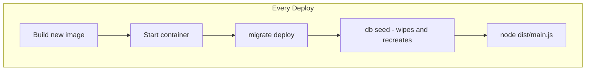
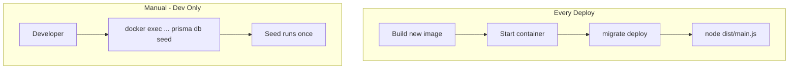

# MEDIUM-3: Seed Runs on Every Server Start Remediation

## Problem

In [server/Dockerfile](server/Dockerfile) (line 50), the CMD runs `npx prisma db seed` on every container start:

```dockerfile
CMD ["sh", "-c", "npx prisma migrate deploy && npx prisma db seed && node dist/src/main.js"]
```

The seed script ([server/prisma/seed.ts](server/prisma/seed.ts)) performs a full cleanup (`deleteMany` on all tables) and then creates demo data. Running this on every deploy wipes production data and replaces it with fake data.

**Impact:** Unpredictable or duplicate seed data; in production, data loss on every deploy.

## Current Flow




## Implementation Plan

### 1. Remove seed from server CMD

In [server/Dockerfile](server/Dockerfile), change the CMD to:

```dockerfile
CMD ["sh", "-c", "npx prisma migrate deploy && node dist/src/main.js"]
```

Remove `npx prisma db seed` from the startup sequence. Migrations still run on each start (idempotent); seed no longer runs automatically.

### 2. Document seed usage

Add a section to [docs/BACKUP-AND-RESTORE.md](docs/BACKUP-AND-RESTORE.md) or create [docs/SEEDING.md](docs/SEEDING.md) (or add to SETUP.md):

- **Dev/demo:** Run seed manually when you need fresh demo data:

```bash
  docker exec -it lanita-server npx prisma db seed
  

```

  Or locally: `cd server && npx prisma db seed`

- **Production:** Do not run seed. The seed wipes all data and creates demo content. For a fresh production install, create your school and admin via the application or a dedicated bootstrap script.
- **First-time setup (empty DB):** If you need the default school and admin ([admin@heckteck.com](mailto:admin@heckteck.com)), run seed once before going live. After that, never run it again.

### 3. Update audit backlog

In [docs/AUDIT-REMEDIATION-BACKLOG.md](docs/AUDIT-REMEDIATION-BACKLOG.md):

- MEDIUM-3: Set Status to `[x] Done`
- Plan: Link to this plan file

## Data Flow (After Fix)




## Files to Modify


| File                                                                   | Change                                       |
| ---------------------------------------------------------------------- | -------------------------------------------- |
| [server/Dockerfile](server/Dockerfile)                                 | Remove `npx prisma db seed` from CMD         |
| [docs/SEEDING.md](docs/SEEDING.md) or SETUP.md                         | New or update: document when/how to run seed |
| [docs/AUDIT-REMEDIATION-BACKLOG.md](docs/AUDIT-REMEDIATION-BACKLOG.md) | Update MEDIUM-3 status and plan link         |


## Verification

- Deploy (or `docker-compose up --build`); verify server starts without running seed
- Run `docker exec lanita-server npx prisma db seed` manually; verify seed works when explicitly invoked
- Confirm existing production data is not wiped on deploy

## Optional: Idempotent Seed (Out of Scope)

A future enhancement could make the seed idempotent (e.g. only create default school/admin if they do not exist). The current seed is destructive by design for dev reset. This remediation focuses on not running it automatically.
