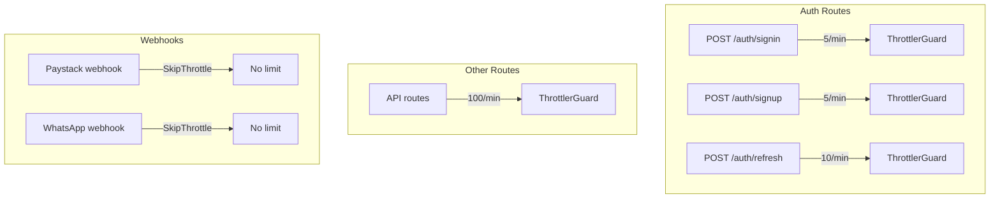

# MEDIUM-5: Auth Endpoints Need Stricter Rate Limits

## Problem

Global throttle is 100 req/min per IP ([server/src/app.module.ts](server/src/app.module.ts) line 41). Login and refresh should be stricter to limit brute force and token abuse.

**Impact:** Easier brute-force or token-guessing attacks on auth.

## Current State


| Route                              | Current limit | Notes                                     |
| ---------------------------------- | ------------- | ----------------------------------------- |
| Global default                     | 100/min       | [app.module.ts](server/src/app.module.ts) |
| POST /auth/signup                  | 5/min         | Already has `@Throttle`                   |
| POST /auth/signin                  | 5/min         | Already has `@Throttle`                   |
| POST /auth/refresh                 | 100/min       | **Uses global; no override**              |
| POST /auth/logout, change-password | 100/min       | Protected by JWT; lower risk              |
| Paystack webhook                   | SkipThrottle  | Signature-validated                       |
| WhatsApp webhook                   | SkipThrottle  | Verify-token validated                    |


The **refresh** endpoint is the main gap: an attacker with a stolen refresh token could attempt 100 token refreshes/min, or an attacker could probe refresh tokens at 100/min.

## Implementation Plan

### 1. Add @Throttle to auth/refresh

In [server/src/auth/auth.controller.ts](server/src/auth/auth.controller.ts), add `@Throttle({ default: { limit: 10, ttl: 60000 } })` to the `refreshTokens` handler (around line 34).

- **10/min** balances security with normal use (e.g. multiple tabs refreshing). Use 5/min for stricter consistency with signin if preferred.
- The decorator overrides the global 100/min for this route only.

```ts
@UseGuards(AuthGuard('jwt-refresh'))
@Post('refresh')
@HttpCode(HttpStatus.OK)
@Throttle({ default: { limit: 10, ttl: 60000 } })
refreshTokens(@Request() req) { ... }
```

### 2. Optional: Throttle signup more strictly

Signup already has 5/min. No change needed unless you want to document or adjust.

### 3. Webhooks: Keep SkipThrottle or add generous limit

- **Paystack** ([server/src/billing/paystack-webhook.controller.ts](server/src/billing/paystack-webhook.controller.ts)): Keep `@SkipThrottle` — webhook is validated by HMAC signature; Paystack may retry.
- **WhatsApp** ([server/src/notifications/webhook.controller.ts](server/src/notifications/webhook.controller.ts)): Keep `@SkipThrottle` — validated by verify token.

Alternative: Replace `@SkipThrottle` with `@Throttle({ default: { limit: 60, ttl: 60000 } })` on webhooks for defense in depth. Document that Paystack retries may require a higher limit; 60/min is usually sufficient.

**Recommendation:** Keep SkipThrottle for webhooks; they are validated by signature/token.

### 4. Document rate limits

Add a short section to [docs/SECURITY.md](docs/SECURITY.md) or [SETUP.md](SETUP.md) (or create if missing):

- Auth signin/signup: 5 req/min per IP
- Auth refresh: 10 req/min per IP
- Other API: 100 req/min per IP
- Webhooks: SkipThrottle (validated by signature)

### 5. Update audit backlog

In [docs/AUDIT-REMEDIATION-BACKLOG.md](docs/AUDIT-REMEDIATION-BACKLOG.md):

- MEDIUM-5: Set Status to `[x] Done`
- Plan: Link to this plan file

## Data Flow (After Fix)




## Files to Modify


| File                                                                     | Change                                                                      |
| ------------------------------------------------------------------------ | --------------------------------------------------------------------------- |
| [server/src/auth/auth.controller.ts](server/src/auth/auth.controller.ts) | Add `@Throttle({ default: { limit: 10, ttl: 60000 } })` to refresh endpoint |
| [docs/SECURITY.md](docs/SECURITY.md) or [SETUP.md](SETUP.md)             | Document rate limits (create if missing)                                    |
| [docs/AUDIT-REMEDIATION-BACKLOG.md](docs/AUDIT-REMEDIATION-BACKLOG.md)   | Update MEDIUM-5 status and plan link                                        |


## Verification

- Call `POST /auth/refresh` 11+ times within 1 minute from same IP; 11th request should return 429.
- Call `POST /auth/signin` 6+ times; 6th should return 429 (already enforced).
- Call `POST /auth/refresh` 11+ times; 11th should return 429 (new).
- Other API routes remain at 100/min.

## Out of Scope

- Named throttlers (e.g. short/medium/long) — current `@Throttle({ default: { ... } })` is sufficient
- Per-user rate limits (would require custom guard)
- IP allowlist for webhooks

