# MVP Hardening: Fixes 1-5

## Pre-requisite: Bug Fixes Discovered During Audit

Before starting the 5 fixes, there are pre-existing bugs that must be corrected or they will block work:

- [server/src/classes/classes.service.ts](server/src/classes/classes.service.ts) line ~28: `findOne` calls `prisma.class.create` instead of `prisma.class.findUnique`
- [server/src/classes/classes.service.ts](server/src/classes/classes.service.ts) line ~47: `remove` references undefined `data` variable
- [server/src/sections/sections.service.ts](server/src/sections/sections.service.ts) line ~50: `findOne` references `parent` instead of `true`
- [server/src/sections/sections.service.ts](server/src/sections/sections.service.ts) line ~63: `remove` calls `prisma.remove.delete` instead of `prisma.section.delete`

---

## Fix 1: Authentication Hardening

**Goal:** Make auth production-viable -- refresh tokens, logout, rate limiting, sensitive field exclusion, and dynamic CORS.

### 1A. Server: Refresh Token Endpoint

**File:** [server/src/auth/auth.controller.ts](server/src/auth/auth.controller.ts)

Add two new routes:

```typescript
@UseGuards(AuthGuard('jwt-refresh'))
@Post('refresh')
refreshTokens(@Request() req) {
  const userId = req.user.sub;
  const refreshToken = req.user.refreshToken;
  return this.authService.refreshTokens(userId, refreshToken);
}

@UseGuards(AuthGuard('jwt'))
@Post('logout')
@HttpCode(HttpStatus.OK)
logout(@Request() req) {
  return this.authService.logout(req.user.sub);
}
```

**File:** [server/src/auth/auth.service.ts](server/src/auth/auth.service.ts)

Add two methods:

- `refreshTokens(userId, refreshToken)`: Verify the stored hashed refresh token matches via `argon2.verify`, then issue new token pair and update stored hash. Throw `ForbiddenException` if mismatch.
- `logout(userId)`: Set `refreshToken` to `null` on the User record.

### 1B. Server: Exclude Sensitive Fields

**File:** [server/src/main.ts](server/src/main.ts)

Register `ClassSerializerInterceptor` globally:

```typescript
import { ClassSerializerInterceptor } from '@nestjs/common';
import { Reflector } from '@nestjs/core';
// ...
app.useGlobalInterceptors(new ClassSerializerInterceptor(app.get(Reflector)));
```

Create a new file `server/src/common/entities/user.entity.ts` with a `UserEntity` class that uses `@Exclude()` on `passwordHash` and `refreshToken`, and a constructor that does `Object.assign(this, partial)`. Then update services that return User objects to wrap results: `return new UserEntity(user)`.

An alternative (less disruptive) approach: create a Prisma global middleware or use `select` clauses in every query to omit `passwordHash` and `refreshToken` fields. The entity approach is cleaner long-term.

### 1C. Server: Dynamic CORS

**File:** [server/src/main.ts](server/src/main.ts)

Replace hardcoded origins:

```typescript
app.enableCors({
  origin: configService.get<string>('CORS_ORIGIN', 'http://localhost:3000').split(','),
  // ...rest stays the same
});
```

Update [.env.example](.env.example) to include `CORS_ORIGIN=http://localhost:3000`.

### 1D. Server: Rate Limiting

Install `@nestjs/throttler`.

**File:** [server/src/app.module.ts](server/src/app.module.ts) -- add `ThrottlerModule.forRoot([{ ttl: 60000, limit: 10 }])`.

**File:** [server/src/auth/auth.controller.ts](server/src/auth/auth.controller.ts) -- add `@Throttle({ default: { limit: 5, ttl: 60000 } })` on `signin` and `signup`.

### 1E. Client: Token Refresh Flow

**File:** [client/src/lib/axios.ts](client/src/lib/axios.ts)

Replace the TODO in the 401 response interceptor with actual refresh logic:

- On 401, check if a refresh is already in progress (use a module-scoped `let isRefreshing = false` and a `failedQueue` array).
- If not refreshing: set `isRefreshing = true`, call `POST /auth/refresh` with the refresh token as `Authorization: Bearer <refreshToken>`, store new tokens in `localStorage`, replay all queued requests, reset flag.
- If already refreshing: push the failed request onto the queue and return a new Promise that resolves when the refresh completes.
- If refresh itself fails (403/401): clear storage and redirect to `/login`.

### 1F. Client: Store User Object from Token

**File:** [client/src/app/(auth)/login/page.tsx](client/src/app/(auth)/login/page.tsx) (wherever login handles the response)

After receiving tokens from `/auth/signin`, decode the access token payload and store a clean `user` object (`{ id: sub, email, role }`) in `localStorage`. This is already happening -- just verify it's consistent.

---

## Fix 2: Kill the Dead Sidebar Links

**Goal:** Every link in the sidebar either leads to a real page or is removed.

### 2A. Backend: Teachers List Endpoint

Create a new module or add to an existing controller. Simplest: add to the existing [server/src/auth/auth.controller.ts](server/src/auth/auth.controller.ts) or create a lightweight `server/src/teachers/` module.

Recommended: Create `server/src/teachers/` module with:

- **TeachersController**: `GET /teachers` (ADMIN, SUPER_ADMIN) -- returns paginated list of users with `role: TEACHER`, including profile and allocation count.
- **TeachersService**: Query `prisma.user.findMany({ where: { role: TEACHER }, include: { profile: true, teacherAllocations: { include: { section: { include: { class: true } }, subject: true } } } })`.

This also fixes the hardcoded `totalTeachers: 5` on the dashboard.

### 2B. Frontend: Teachers Page

**New file:** `client/src/app/(dashboard)/dashboard/teachers/page.tsx`

- DataTable listing teachers (name, email, subjects, classes assigned).
- Use React Query: `useQuery({ queryKey: ['teachers'], queryFn: ... })`.
- Pattern: follow the existing students page structure.

### 2C. Frontend: Classes Page

**New file:** `client/src/app/(dashboard)/dashboard/classes/page.tsx`

- Display classes with their sections and student counts.
- Backend already supports this: `GET /classes` returns classes with `_count.sections`, and `GET /sections` returns sections with class info.
- Show as accordion or card layout: each Class card expands to show sections with student counts and capacity.

### 2D. Frontend: Admin Attendance Overview Page

**New file:** `client/src/app/(dashboard)/dashboard/attendance/page.tsx`

- Date picker (default today) + class/section filter.
- Use existing `GET /attendance/report` endpoint.
- Show attendance summary: total present/absent/late/excused for the selected scope and date.

### 2E. Frontend: Student Grades Page

**New file:** `client/src/app/(dashboard)/student/grades/page.tsx`

- Wrap in `RoleGuard allowedRoles={["STUDENT"]}`.
- Fetch results via `GET /results/student/:studentId` (using `user.id` from auth).
- Display as a table grouped by exam: Subject | Score | Grade.

### 2F. Frontend: Student Attendance Page

**New file:** `client/src/app/(dashboard)/student/attendance/page.tsx`

- Wrap in `RoleGuard`.
- Fetch via `GET /attendance/report?studentId=...`.
- Display monthly calendar view or simple table with date, subject, status.

### 2G. Handle Parent Billing Link

Since fee management is a V2 feature, **remove** the "Fees/Billing" link from [client/src/components/sidebar.tsx](client/src/components/sidebar.tsx) `parentNavigation` array, or replace it with a "Coming Soon" placeholder page. Do not leave a dead link.

### 2H. Frontend: Add Student Dialog

**File:** [client/src/app/(dashboard)/students/page.tsx](client/src/app/(dashboard)/students/page.tsx)

The "Add Student" button currently links to `/students/new` which doesn't exist. Two options:

- **Option A (recommended):** Create a Sheet/Dialog component inline on the students page using React Hook Form + Zod. Fields: firstName, lastName, email, dob, gender, contactNumber, address, sectionId (select from `GET /sections`). On submit: `POST /students`.
- **Option B:** Create `client/src/app/(dashboard)/students/new/page.tsx` as a full-page form.

---

## Fix 3: Wire Real Data to Dashboard Charts

**Goal:** Replace all mock/hardcoded data with live API data.

### 3A. Backend: Dashboard Stats Endpoint

**File:** Add `GET /analytics/dashboard` to [server/src/analytics/analytics.controller.ts](server/src/analytics/analytics.controller.ts)

New method in [server/src/analytics/analytics.service.ts](server/src/analytics/analytics.service.ts):

```typescript
async getDashboardStats() {
  const [totalStudents, totalTeachers, currentYear, distributionByClass, weeklyAttendance] = await Promise.all([
    this.prisma.user.count({ where: { role: 'STUDENT', isActive: true } }),
    this.prisma.user.count({ where: { role: 'TEACHER', isActive: true } }),
    this.prisma.academicYear.findFirst({ where: { isCurrent: true } }),
    this.prisma.class.findMany({
      include: { sections: { include: { _count: { select: { students: true } } } } },
    }),
    // Weekly attendance: aggregate last 5 school days
    this.getWeeklyAttendance(),
  ]);
  // ... shape and return
}
```

`getWeeklyAttendance()`: Query `attendanceRecord` for the last 5 weekdays, group by date, count `PRESENT` vs `ABSENT` vs `LATE` vs `EXCUSED`.

Response shape:

```typescript
{
  totalStudents: number;
  totalTeachers: number;
  currentTerm: string;
  weeklyAttendance: Array<{ day: string; present: number; absent: number }>;
  distributionByClass: Array<{ name: string; value: number }>;
}
```

### 3B. Frontend: Wire AttendanceChart

**File:** [client/src/components/dashboard/attendance-chart.tsx](client/src/components/dashboard/attendance-chart.tsx)

- Accept `data` as a prop (or fetch internally via React Query from `GET /analytics/dashboard`).
- Remove `mockData` constant.
- Show a skeleton/spinner while loading.

### 3C. Frontend: Wire DistributionChart

**File:** [client/src/components/dashboard/distribution-chart.tsx](client/src/components/dashboard/distribution-chart.tsx)

- Same pattern: accept data as prop or fetch from the dashboard stats endpoint.
- Remove `mockData` constant.

### 3D. Frontend: Wire Dashboard Page

**File:** [client/src/app/(dashboard)/dashboard/page.tsx](client/src/app/(dashboard)/dashboard/page.tsx)

- Replace the manual `fetchDashboardData` with a single `useQuery` call to `GET /analytics/dashboard`.
- Remove the hardcoded `totalTeachers: 5`.
- Pass `weeklyAttendance` to `AttendanceChart` and `distributionByClass` to `DistributionChart`.

---

## Fix 4: Add Term Model

**Goal:** Ghanaian schools run 3 terms per academic year. Exams and report cards are per-term.

### 4A. Prisma Schema Change

**File:** [server/prisma/schema.prisma](server/prisma/schema.prisma)

Add new model:

```prisma
model Term {
  id             String       @id @default(uuid()) @db.Uuid
  name           String
  startDate      DateTime
  endDate        DateTime
  isCurrent      Boolean      @default(false)
  academicYear   AcademicYear @relation(fields: [academicYearId], references: [id])
  academicYearId String       @db.Uuid
  exams          Exam[]
  createdAt      DateTime     @default(now())
  updatedAt      DateTime     @updatedAt

  @@unique([academicYearId, name])
}
```

Update `AcademicYear`: add `terms Term[]` relation, change `isCurrent` to `status` enum (optional -- can be deferred if risky).

Update `Exam`: add `term Term @relation(...)` + `termId String @db.Uuid` field. Keep `academicYearId` for backward compat or derive it from the term.

### 4B. Backend: Term Module

Create `server/src/terms/` module (controller, service, DTO):

- `POST /terms` (ADMIN, SUPER_ADMIN): Create a term under an academic year.
- `GET /terms?academicYearId=...`: List terms for a year.
- `PATCH /terms/:id/set-active`: Set a term as current (unset others in the same year).

### 4C. Update Seed

**File:** [server/prisma/seed.ts](server/prisma/seed.ts)

After creating the academic year, create 3 terms:

- Term 1: Sep-Dec
- Term 2: Jan-Mar
- Term 3: Apr-Jul

Link the seed exam to Term 1.

### 4D. Migration

Run `npx prisma migrate dev --name add-term-model` after schema changes.

---

## Fix 5: Global Exception Filter + Swagger

**Goal:** Standardized error responses and auto-generated API documentation.

### 5A. Global Exception Filter

**New file:** `server/src/common/filters/http-exception.filter.ts`

```typescript
@Catch()
export class AllExceptionsFilter implements ExceptionFilter {
  catch(exception: unknown, host: ArgumentsHost) {
    const ctx = host.switchToHttp();
    const response = ctx.getResponse();
    const request = ctx.getRequest();

    let status = 500;
    let message = 'Internal server error';

    if (exception instanceof HttpException) {
      status = exception.getStatus();
      const exResponse = exception.getResponse();
      message = typeof exResponse === 'string' ? exResponse : (exResponse as any).message;
    }

    response.status(status).json({
      statusCode: status,
      message,
      timestamp: new Date().toISOString(),
      path: request.url,
    });
  }
}
```

**File:** [server/src/main.ts](server/src/main.ts) -- register with `app.useGlobalFilters(new AllExceptionsFilter())`.

### 5B. Swagger/OpenAPI Setup

Install: `npm install @nestjs/swagger`

**File:** [server/src/main.ts](server/src/main.ts)

```typescript
import { DocumentBuilder, SwaggerModule } from '@nestjs/swagger';

const config = new DocumentBuilder()
  .setTitle('Lanita SMS API')
  .setDescription('School Management System API')
  .setVersion('1.0')
  .addBearerAuth()
  .build();
const document = SwaggerModule.createDocument(app, config);
SwaggerModule.setup('api/docs', app, document);
```

Then progressively add `@ApiTags()`, `@ApiOperation()`, `@ApiResponse()` decorators to controllers. Start with the most critical: `AuthController`, `StudentsController`, `AttendanceController`.

Add `@ApiBearerAuth()` to all guarded controllers.

---

## Execution Order

```mermaid
flowchart TD
    subgraph phase0 [Phase 0: Pre-reqs]
        BugFixes["Fix pre-existing bugs in ClassesService, SectionsService"]
    end

    subgraph phase1 [Phase 1: Foundation]
        Fix1A["1A: Refresh + Logout endpoints"]
        Fix1B["1B: Exclude sensitive fields"]
        Fix1C["1C: Dynamic CORS"]
        Fix1D["1D: Rate limiting"]
        Fix5A["5A: Global exception filter"]
        Fix5B["5B: Swagger setup"]
    end

    subgraph phase2 [Phase 2: Schema]
        Fix4A["4A: Add Term model"]
        Fix4B["4B: Term module + CRUD"]
        Fix4C["4C: Update seed"]
        Fix4D["4D: Run migration"]
    end

    subgraph phase3 [Phase 3: Backend APIs]
        Fix2A["2A: Teachers endpoint"]
        Fix3A["3A: Dashboard stats endpoint"]
    end

    subgraph phase4 [Phase 4: Frontend Pages]
        Fix1E["1E: Client token refresh"]
        Fix2B["2B: Teachers page"]
        Fix2C["2C: Classes page"]
        Fix2D["2D: Attendance overview"]
        Fix2E["2E: Student grades page"]
        Fix2F["2F: Student attendance page"]
        Fix2G["2G: Remove/fix billing link"]
        Fix2H["2H: Add Student form"]
        Fix3BCD["3B-D: Wire charts + dashboard"]
    end

    phase0 --> phase1
    phase1 --> phase2
    phase2 --> phase3
    phase3 --> phase4
```



Phase 0 and 1 can be done in ~1.5 days. Phase 2 in ~1 day. Phase 3 in ~0.5 day. Phase 4 in ~2-3 days. Total: ~5-7 days.
