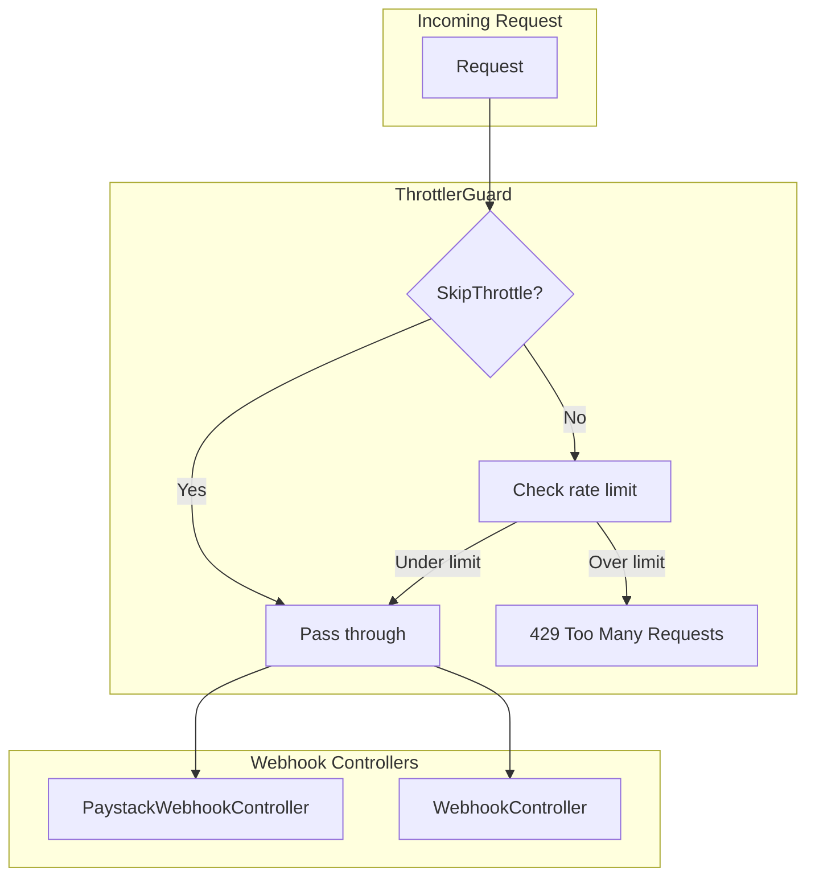

# NestJS Throttler Rate Limiting Configuration

## Current State

- **Package**: `@nestjs/throttler` v6.5.0 is already installed in [server/package.json](server/package.json)
- **ThrottlerModule**: Already imported in [server/src/app.module.ts](server/src/app.module.ts) with `{ ttl: 60000, limit: 10 }` (10 req/60s)
- **ThrottlerGuard**: Not registered globally
- **Webhooks**: Paystack at `POST billing/paystack/webhook`, WhatsApp at `GET/POST webhooks/whatsapp` — both need exemption

---

## Implementation Steps

### 1. Install Command (if needed)

The package is already in `package.json`. To ensure it is installed:

```bash
cd server && npm install
```

---

### 2. Update ThrottlerModule Configuration

In [server/src/app.module.ts](server/src/app.module.ts), change the limit from 10 to 100:

```ts
ThrottlerModule.forRoot([{ ttl: 60000, limit: 100 }]),
```

---

### 3. Register ThrottlerGuard Globally

In [server/src/app.module.ts](server/src/app.module.ts):

- Add `APP_GUARD` from `@nestjs/core`
- Add `ThrottlerGuard` from `@nestjs/throttler`
- Add providers:

```ts
import { APP_GUARD } from '@nestjs/core';
import { ThrottlerGuard } from '@nestjs/throttler';

// In providers array:
{
  provide: APP_GUARD,
  useClass: ThrottlerGuard,
},
```

---

### 4. Exempt Webhook Endpoints

Use `@SkipThrottle()` from `@nestjs/throttler` on the webhook controllers:

**Option A: Controller-level (recommended)** — Apply to entire controller:

- [server/src/billing/paystack-webhook.controller.ts](server/src/billing/paystack-webhook.controller.ts): Add `@SkipThrottle()` above `@Controller('billing/paystack')`
- [server/src/notifications/webhook.controller.ts](server/src/notifications/webhook.controller.ts): Add `@SkipThrottle()` above `@Controller('webhooks')`

**Option B: Custom decorator (optional)** — For shared semantics and documentation:

Create [server/src/common/decorators/skip-throttle-webhook.decorator.ts](server/src/common/decorators/skip-throttle-webhook.decorator.ts):

```ts
import { applyDecorators } from '@nestjs/common';
import { SkipThrottle } from '@nestjs/throttler';

/**
 * Decorator for webhook endpoints that receive bursts from external services
 * (Paystack, WhatsApp, etc.) and should bypass rate limiting.
 */
export const SkipThrottleForWebhooks = () => SkipThrottle();
```

Then use `@SkipThrottleForWebhooks()` on the webhook controllers instead of `@SkipThrottle()`.

---

## Flow Summary




---

## Files to Modify


| File                                                                                                                               | Action                                              |
| ---------------------------------------------------------------------------------------------------------------------------------- | --------------------------------------------------- |
| [server/src/app.module.ts](server/src/app.module.ts)                                                                               | Update limit to 100; add APP_GUARD + ThrottlerGuard |
| [server/src/billing/paystack-webhook.controller.ts](server/src/billing/paystack-webhook.controller.ts)                             | Add @SkipThrottle()                                 |
| [server/src/notifications/webhook.controller.ts](server/src/notifications/webhook.controller.ts)                                   | Add @SkipThrottle()                                 |
| [server/src/common/decorators/skip-throttle-webhook.decorator.ts](server/src/common/decorators/skip-throttle-webhook.decorator.ts) | Create (optional, for Option B)                     |


---

## Verification

- Public endpoints (e.g. login): rate limited to 100 req/60s per IP
- Webhook endpoints: no rate limit
- Over-limit requests: 429 HTTP status

