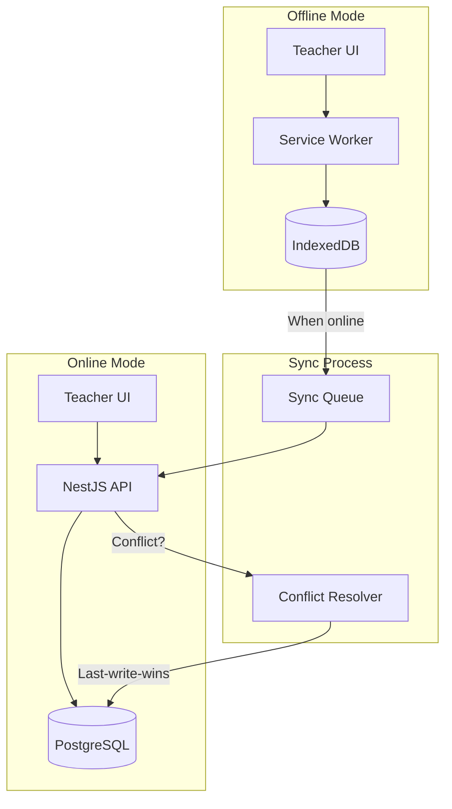

# V2.1: Offline-First Capabilities (PWA)

## Overview

Ghana has intermittent internet connectivity. Teachers must be able to mark attendance offline and sync when connectivity returns. This plan converts Lanita into a Progressive Web App with offline-first architecture.




---

## Phase 1: PWA Foundation

### 1.1 Next.js PWA Configuration

**Install:** `npm install next-pwa`

**File:** `client/next.config.js`

```javascript
const withPWA = require('next-pwa')({
  dest: 'public',
  register: true,
  skipWaiting: true,
  disable: process.env.NODE_ENV === 'development',
});

module.exports = withPWA({
  // existing config
});
```

### 1.2 Web App Manifest

**File:** `client/public/manifest.json`

```json
{
  "name": "Lanita School Management System",
  "short_name": "Lanita SMS",
  "description": "School Management System for Ghanaian Schools",
  "start_url": "/",
  "display": "standalone",
  "background_color": "#ffffff",
  "theme_color": "#0f172a",
  "icons": [
    { "src": "/icons/icon-192.png", "sizes": "192x192", "type": "image/png" },
    { "src": "/icons/icon-512.png", "sizes": "512x512", "type": "image/png" }
  ]
}
```

### 1.3 Service Worker Strategy

**Caching strategies:**

- **Static assets**: Cache-first (CSS, JS, images)
- **API responses**: Network-first with cache fallback
- **Attendance data**: IndexedDB for offline mutations

---

## Phase 2: IndexedDB Integration

### 2.1 Database Schema

**File:** `client/src/lib/offline-db.ts`

Use Dexie.js for IndexedDB abstraction:

```typescript
import Dexie from 'dexie';

export class OfflineDB extends Dexie {
  attendanceQueue!: Table<PendingAttendance>;
  cachedStudents!: Table<CachedStudent>;
  syncStatus!: Table<SyncStatus>;

  constructor() {
    super('LanitaOfflineDB');
    this.version(1).stores({
      attendanceQueue: '++id, allocationId, date, syncStatus, createdAt',
      cachedStudents: 'id, sectionId, name',
      syncStatus: 'key, value',
    });
  }
}

interface PendingAttendance {
  id?: number;
  allocationId: string;
  date: string;
  records: Array<{ studentId: string; status: string; remarks?: string }>;
  syncStatus: 'pending' | 'syncing' | 'synced' | 'failed';
  createdAt: number;
  updatedAt: number;
}
```

### 2.2 Offline Attendance Hook

**File:** `client/src/hooks/use-offline-attendance.ts`

```typescript
export function useOfflineAttendance(allocationId: string, date: string) {
  const [isOnline, setIsOnline] = useState(navigator.onLine);
  const db = useMemo(() => new OfflineDB(), []);

  // Save to IndexedDB when offline
  const markAttendance = async (records: AttendanceRecord[]) => {
    if (isOnline) {
      return api.post('/attendance/batch', { allocationId, date, records });
    }
    await db.attendanceQueue.add({
      allocationId,
      date,
      records,
      syncStatus: 'pending',
      createdAt: Date.now(),
      updatedAt: Date.now(),
    });
  };

  // Sync pending records when online
  useEffect(() => {
    if (isOnline) syncPendingRecords();
  }, [isOnline]);
}
```

---

## Phase 3: Sync Engine

### 3.1 Background Sync

**File:** `client/src/lib/sync-engine.ts`

```typescript
export async function syncPendingAttendance() {
  const db = new OfflineDB();
  const pending = await db.attendanceQueue
    .where('syncStatus')
    .equals('pending')
    .toArray();

  for (const record of pending) {
    try {
      await db.attendanceQueue.update(record.id!, { syncStatus: 'syncing' });
      await api.post('/attendance/batch', {
        allocationId: record.allocationId,
        date: record.date,
        records: record.records,
        offlineTimestamp: record.createdAt,
      });
      await db.attendanceQueue.update(record.id!, { syncStatus: 'synced' });
    } catch (error) {
      await db.attendanceQueue.update(record.id!, { syncStatus: 'failed' });
    }
  }
}
```

### 3.2 Conflict Resolution (Last-Write-Wins)

**File:** `server/src/attendance/attendance.service.ts`

Update batch attendance to handle offline sync:

```typescript
async markBatchAttendance(dto: BatchAttendanceDto & { offlineTimestamp?: number }) {
  // If offlineTimestamp provided, use last-write-wins
  for (const record of dto.records) {
    const existing = await this.prisma.attendanceRecord.findUnique({
      where: { studentId_allocationId_date: { ... } },
    });

    if (existing && dto.offlineTimestamp) {
      // Compare timestamps - only update if offline record is newer
      if (dto.offlineTimestamp > existing.updatedAt.getTime()) {
        await this.prisma.attendanceRecord.update({ ... });
      }
      // Otherwise skip (server record is newer)
    } else {
      await this.prisma.attendanceRecord.upsert({ ... });
    }
  }
}
```

---

## Phase 4: Offline UI Components

### 4.1 Online/Offline Indicator

**File:** `client/src/components/offline-indicator.tsx`

```typescript
export function OfflineIndicator() {
  const [isOnline, setIsOnline] = useState(true);
  const [pendingCount, setPendingCount] = useState(0);

  // Show banner when offline or has pending syncs
  if (!isOnline) {
    return (
      <div className="bg-yellow-500 text-black px-4 py-2 text-center">
        You are offline. Changes will sync when connected.
        {pendingCount > 0 && ` (${pendingCount} pending)`}
      </div>
    );
  }
}
```

### 4.2 Install Prompt

**File:** `client/src/components/pwa-install-prompt.tsx`

Prompt users to install the PWA on mobile devices.

### 4.3 Offline Fallback Page

**File:** `client/src/app/offline/page.tsx`

Show when user tries to access non-cached pages while offline.

---

## Phase 5: Data Prefetching

### 5.1 Cache Student Lists

When teacher opens attendance page online, cache:

- Student list for their sections
- Recent attendance records

**File:** `client/src/hooks/use-prefetch-attendance.ts`

```typescript
export function usePrefetchAttendance() {
  const { user } = useAuth();
  
  useEffect(() => {
    if (user?.role === 'TEACHER' && navigator.onLine) {
      prefetchTeacherData(user.id);
    }
  }, [user]);
}
```

---

## File Structure

```
client/
├── public/
│   ├── manifest.json
│   ├── sw.js (generated by next-pwa)
│   └── icons/
│       ├── icon-192.png
│       └── icon-512.png
├── src/
│   ├── lib/
│   │   ├── offline-db.ts
│   │   └── sync-engine.ts
│   ├── hooks/
│   │   ├── use-offline-attendance.ts
│   │   └── use-prefetch-attendance.ts
│   ├── components/
│   │   ├── offline-indicator.tsx
│   │   └── pwa-install-prompt.tsx
│   └── app/
│       └── offline/
│           └── page.tsx

server/
└── src/
    └── attendance/
        └── attendance.service.ts (update for conflict resolution)
```

---

## Dependencies

```bash
# Client
npm install next-pwa dexie

# Types
npm install -D @types/serviceworker
```

---

## Testing Considerations

- Test with Chrome DevTools "Offline" mode
- Test sync after reconnection
- Test conflict resolution with simultaneous edits
- Test PWA installation on Android/iOS

