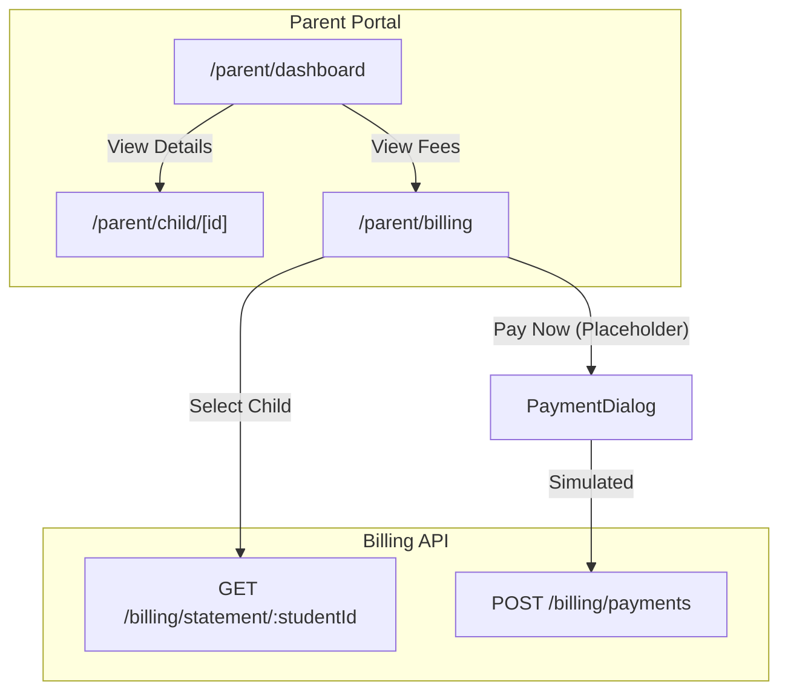
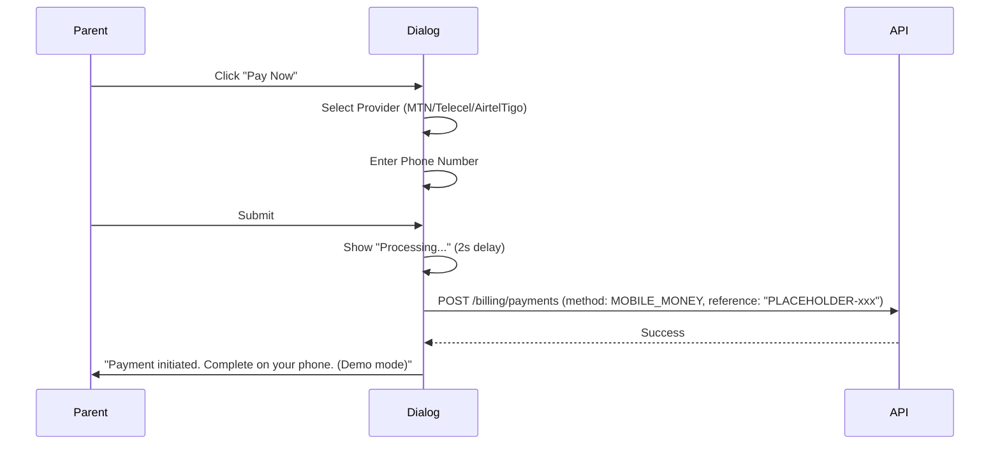

# Parent Financial Portal V2

## Overview

Build the parent-facing financial module that allows parents to view their children's fees, invoices, and payment history. Include a placeholder payment interface for mobile money (MTN, Telecel, AirtelTigo) that shows the UI but simulates payments without actual gateway integration.




---

## Phase 1: Backend Authorization Fix

**File:** [server/src/billing/billing.controller.ts](server/src/billing/billing.controller.ts)

Add parent authorization check to `getStudentStatement` endpoint to ensure parents can only access their own children's statements.

**File:** [server/src/billing/billing.service.ts](server/src/billing/billing.service.ts)

Add method `verifyParentAccess(parentUserId: string, studentRecordId: string)`:

- Query StudentRecord to get parentId
- Throw `ForbiddenException` if `studentRecord.parentId !== parentUserId`

---

## Phase 2: Parent Child Detail Page

**File:** `client/src/app/(dashboard)/parent/child/[id]/page.tsx`

Create missing child detail page that the dashboard links to:

- Fetch child data from `/portal/student/:studentId/summary`
- Display: student info, recent grades, attendance summary
- Add "View Fees" button linking to billing

---

## Phase 3: Parent Billing Page

**File:** `client/src/app/(dashboard)/parent/billing/page.tsx`

**Layout:**

- Header: "Fees & Payments" with Wallet icon
- Child selector dropdown (if parent has multiple children)
- Summary cards: Total Fees, Amount Paid, Outstanding Balance
- Invoice list with status badges
- "Pay Now" action button per invoice

**Data fetching:**

- Fetch children from `/portal/parent/children`
- For selected child, fetch statement from `/billing/statement/:studentId`

---

## Phase 4: Mobile Money Payment Dialog (Placeholder)

**File:** `client/src/components/billing/mobile-money-dialog.tsx`

Create a payment dialog with placeholder mobile money integration:

**UI Elements:**

- Amount field (pre-filled with outstanding balance, editable)
- Provider selector: MTN MoMo, Telecel Cash, AirtelTigo Money
- Phone number input (with validation for Ghana format)
- Reference/description field

**Behavior:**

- On submit: Show loading state for 2 seconds
- Display "Payment Initiated" success message
- Note: "Please complete payment on your phone. This is a demo - no actual transaction."
- Optionally call `POST /billing/payments` to create a PENDING payment record for demo purposes

**Provider Logos/Icons:**

- Use placeholder colored badges: MTN (Yellow), Telecel (Red), AirtelTigo (Blue)

---

## Phase 5: Student Billing View

**File:** `client/src/app/(dashboard)/student/billing/page.tsx`

Allow students to view their own financial statement:

- Fetch from `/billing/statement/:studentId` using auth user's student record
- Read-only view (no payment action for students)
- Display invoices, payments, and balance

---

## Phase 6: Sidebar Navigation Updates

**File:** [client/src/components/sidebar.tsx](client/src/components/sidebar.tsx)

Update `parentNavigation`:

```typescript
const parentNavigation = [
  {
    name: "My Children",
    href: "/parent/dashboard",
    icon: Users,
  },
  {
    name: "Fees & Payments",
    href: "/parent/billing",
    icon: Wallet,
  },
];
```

Update `studentNavigation` to add billing:

```typescript
{
  name: "My Fees",
  href: "/student/billing",
  icon: Wallet,
},
```

---

## File Structure

```
server/src/billing/
├── billing.service.ts    (update: add verifyParentAccess)
└── billing.controller.ts (update: add authorization)

client/src/app/(dashboard)/
├── parent/
│   ├── billing/
│   │   └── page.tsx      (new)
│   └── child/
│       └── [id]/
│           └── page.tsx  (new)
└── student/
    └── billing/
        └── page.tsx      (new)

client/src/components/billing/
└── mobile-money-dialog.tsx (new)
```

---

## Mobile Money Providers Reference


| Provider         | Brand Color      | Phone Prefix       |
| ---------------- | ---------------- | ------------------ |
| MTN MoMo         | #FFCC00 (Yellow) | 024, 054, 055, 059 |
| Telecel Cash     | #E60000 (Red)    | 020, 050           |
| AirtelTigo Money | #0066B3 (Blue)   | 027, 057, 026, 056 |


---

## Placeholder Payment Flow




Note: In production, this flow would integrate with Paystack or Hubtel APIs for actual mobile money processing.