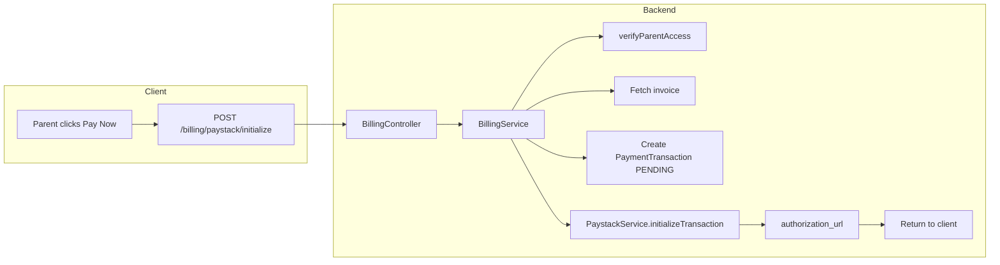

# Paystack Initialize Payment Endpoint

## Current state

- **Billing**: [server/src/billing/billing.controller.ts](server/src/billing/billing.controller.ts) and [server/src/billing/billing.service.ts](server/src/billing/billing.service.ts) exist. No Paystack-related endpoints.
- **Schema**: [server/prisma/schema.prisma](server/prisma/schema.prisma) has `StudentInvoice` and `Payment` but **no `PaymentTransaction`** model. The task requires a `PaymentTransaction` table for pending online payment attempts.
- **PaystackService**: Not found in the codebase. The plan assumes it must be created or is provided; the plan will include creating it if absent.
- **Tenant**: Models use `schoolId` (not `tenantId`). `StudentInvoice` has `schoolId`; tenant extension applies when present.
- **Parent email**: `StudentInvoice` → `student` → `parent` (User via `parentId`). Parent's `email` is required for Paystack.

---

## 1. Prisma: Add PaymentTransaction model

In [server/prisma/schema.prisma](server/prisma/schema.prisma):

- Add enum `TransactionStatus { PENDING, SUCCESS, FAILED }` (or reuse existing if present).
- Add model `PaymentTransaction`:
  - `id` (UUID), `schoolId` (UUID, optional for tenant), `invoiceId` (UUID), `reference` (String, unique), `amount` (Decimal), `status` (TransactionStatus, default PENDING), `paystackReference` (String?), `createdAt`, `updatedAt`.
  - Relations: `school` (School), `invoice` (StudentInvoice).
  - Indexes: `@@index([schoolId])`, `@@index([invoiceId])`, `@@unique([reference])`.
- Add `paymentTransactions PaymentTransaction[]` to `School` and `StudentInvoice`.

Run `npx prisma generate` (and migrate if applicable).

---

## 2. PaystackService (if not present)

Create [server/src/paystack/paystack.service.ts](server/src/paystack/paystack.service.ts):

- Inject `ConfigService` to read `PAYSTACK_SECRET_KEY`.
- Method `initializeTransaction(params: { email: string; amountInPesewas: number; reference: string; callbackUrl: string })`:
  - POST to `https://api.paystack.co/transaction/initialize` with headers `Authorization: Bearer SECRET_KEY`, `Content-Type: application/json`.
  - Body: `{ email, amount: amountInPesewas, reference, callback_url: callbackUrl }`.
  - Parse response; if `data.status === true`, return `{ authorization_url: data.data.authorization_url }`.
  - On failure, throw `BadRequestException` with Paystack message.

Create [server/src/paystack/paystack.module.ts](server/src/paystack/paystack.module.ts) and export `PaystackService`. Register `PaystackModule` in `AppModule` and import it in `BillingModule`.

---

## 3. DTOs

Create [server/src/billing/dto/initialize-paystack.dto.ts](server/src/billing/dto/initialize-paystack.dto.ts):

```ts
export class InitializePaystackDto {
  @IsUUID()
  @IsNotEmpty()
  invoiceId: string;

  @IsString()
  @IsNotEmpty()
  @IsUrl()
  callbackUrl: string;
}
```

Use `@IsUrl()` from `class-validator` for `callbackUrl`.

---

## 4. BillingService: initializePaystackPayment

Add to [server/src/billing/billing.service.ts](server/src/billing/billing.service.ts):

- Inject `PaystackService` and `ConfigService` (if needed).
- Method `initializePaystackPayment(dto: InitializePaystackDto, parentUserId: string)`:
  1. Validate parent access: `verifyParentAccess(parentUserId, invoice.studentId)` — fetch invoice with `student: { include: { parent: true } }` to get `student.parentId`; if `student.parentId !== parentUserId` throw `ForbiddenException`.
  2. Fetch invoice: `prisma.studentInvoice.findFirst({ where: { id: dto.invoiceId }, include: { student: { include: { parent: true } } } })`. If not found, throw `NotFoundException`. If `invoice.status === PAID`, throw `BadRequestException`.
  3. Compute remaining: `remaining = totalAmount - amountPaid`. If `remaining <= 0`, throw `BadRequestException`.
  4. Generate reference: `uuidv4()` (e.g. from `crypto.randomUUID()` or `uuid` package).
  5. Create `PaymentTransaction`: `prisma.paymentTransaction.create({ data: { schoolId: invoice.schoolId, invoiceId, reference, amount: remaining, status: 'PENDING' } })`. Ensure `schoolId` is set (invoice may have it).
  6. Get parent email: `invoice.student.parent?.email`. If no parent or no email, throw `BadRequestException`.
  7. Convert amount to pesewas: `Math.round(remaining.toNumber() * 100)`.
  8. Call `paystackService.initializeTransaction({ email, amountInPesewas, reference, callbackUrl: dto.callbackUrl })`.
  9. Return `{ authorization_url }` from Paystack response.

---

## 5. BillingController: POST /billing/paystack/initialize

Add to [server/src/billing/billing.controller.ts](server/src/billing/billing.controller.ts):

- Add `@Post('paystack/initialize')` endpoint.
- `@Roles(UserRole.PARENT)` — only parents can initiate payment for their children's invoices.
- Handler: `initializePaystack(@Body() dto: InitializePaystackDto, @Request() req)` → `billingService.initializePaystackPayment(dto, req.user.sub)`.
- Return `{ authorization_url: string }`.

---

## 6. Tenant extension and PrismaService

- Add `'PaymentTransaction'` to `TENANT_MODELS` in [server/src/prisma/prisma-tenant.extension.ts](server/src/prisma/prisma-tenant.extension.ts) if the model has `schoolId`.
- Add `paymentTransaction` getter to [server/src/prisma/prisma.service.ts](server/src/prisma/prisma.service.ts) if Prisma exposes it.

---

## Data flow




---

## File summary


| Action | File                                                                                                                                   |
| ------ | -------------------------------------------------------------------------------------------------------------------------------------- |
| Edit   | [server/prisma/schema.prisma](server/prisma/schema.prisma) — add TransactionStatus enum, PaymentTransaction model, relations           |
| Create | [server/src/paystack/paystack.service.ts](server/src/paystack/paystack.service.ts) — initializeTransaction (if not present)            |
| Create | [server/src/paystack/paystack.module.ts](server/src/paystack/paystack.module.ts)                                                       |
| Edit   | [server/src/app.module.ts](server/src/app.module.ts) — import PaystackModule                                                           |
| Edit   | [server/src/billing/billing.module.ts](server/src/billing/billing.module.ts) — import PaystackModule                                   |
| Create | [server/src/billing/dto/initialize-paystack.dto.ts](server/src/billing/dto/initialize-paystack.dto.ts)                                 |
| Edit   | [server/src/billing/billing.service.ts](server/src/billing/billing.service.ts) — add initializePaystackPayment                         |
| Edit   | [server/src/billing/billing.controller.ts](server/src/billing/billing.controller.ts) — add POST paystack/initialize                    |
| Edit   | [server/src/prisma/prisma-tenant.extension.ts](server/src/prisma/prisma-tenant.extension.ts) — add PaymentTransaction to TENANT_MODELS |
| Edit   | [server/src/prisma/prisma.service.ts](server/src/prisma/prisma.service.ts) — add paymentTransaction getter                             |


**Note:** If `PaystackService` already exists elsewhere, skip creating it and use the existing implementation. Ensure `initializeTransaction` accepts `email`, `amountInPesewas`, `reference`, and `callbackUrl`, and returns `authorization_url`.