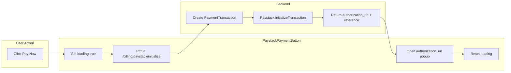

# PaystackPaymentButton Refactor

## Current state

- **PaystackPaymentButton**: Does not exist. The task says "update" but the file [client/src/components/billing/paystack-button.tsx](client/src/components/billing/paystack-button.tsx) is absent; we will create it.
- **Parent billing**: [client/src/app/(dashboard)/parent/billing/page.tsx](client/src/app/(dashboard)/parent/billing/page.tsx) uses a "Pay Now" button that opens [client/src/components/billing/mobile-money-dialog.tsx](client/src/components/billing/mobile-money-dialog.tsx) (mobile money flow).
- **Backend**: `POST /billing/paystack/initialize` accepts `{ invoiceId, callbackUrl }` and returns `{ authorization_url }`. It does not return `reference`; the task asks to "extract the newly generated reference" — we will add it to the response.
- **Client**: Uses `axios` from [client/src/lib/axios.ts](client/src/lib/axios.ts) (with auth interceptors). Uses `sonner` for toasts. No Paystack-related packages in [client/package.json](client/package.json).

---

## 1. Backend: Add reference to initialize response

In [server/src/billing/billing.service.ts](server/src/billing/billing.service.ts), update `initializePaystackPayment` return:

```ts
return {
  authorization_url: result.authorization_url,
  reference,
};
```

This lets the frontend use the reference for tracking or future Paystack APIs if needed.

---

## 2. Create PaystackPaymentButton component

Create [client/src/components/billing/paystack-button.tsx](client/src/components/billing/paystack-button.tsx):

**Props:**

- `invoiceId: string` (required)
- `callbackUrl?: string` (optional; default: `${window.location.origin}/parent/billing?payment=callback`)
- `children?: React.ReactNode` (optional; default: "Pay Now")
- `className?: string`, `variant?`, `size?` (optional; pass through to Button)
- `onSuccess?: () => void` (optional; called after opening Paystack, e.g. to refetch data when user returns)
- `disabled?: boolean`

**Behavior:**

1. On click: set `isLoading` true, disable button (prevent double-clicks).
2. Call `axios.post('/billing/paystack/initialize', { invoiceId, callbackUrl })`.
3. On success: extract `authorization_url` (and optionally `reference`). Open Paystack checkout by:
  - **Option A (recommended):** `window.open(authorization_url, 'paystack', 'width=500,height=700,scrollbars=yes')` — popup that behaves like a modal.
  - **Option B:** `window.location.href = authorization_url` — full redirect.
  - Use Option A for a modal-like experience.
4. On error: show error toast via `toast.error(...)`, reset `isLoading` to false.
5. Reset `isLoading` to false after opening the URL (the popup/redirect is async from the user's perspective; we don't wait for payment completion).

**Implementation notes:**

- Use `useState` for `isLoading`.
- Use `axios` from `@/lib/axios`.
- Use `toast` from `sonner` (already in the project).
- Use `Button` from `@/components/ui/button` with `Loader2` spinner when loading.
- Default `callbackUrl`: `typeof window !== 'undefined' ?` ${window.location.origin}/parent/billing?payment=callback `: ''`

---

## 3. Integrate into parent billing page

In [client/src/app/(dashboard)/parent/billing/page.tsx](client/src/app/(dashboard)/parent/billing/page.tsx):

- Replace the "Pay Now" `Button` (lines 329–334) with `PaystackPaymentButton` when the invoice is not paid:
  - `<PaystackPaymentButton invoiceId={invoice.id} onSuccess={refetchStatement} />`
- The `callbackUrl` can be omitted to use the default, or set explicitly to `${window.location.origin}/parent/billing?payment=callback` for the parent to return after payment.
- Keep or remove `MobileMoneyDialog` — the task focuses on Paystack. For a minimal change, use only `PaystackPaymentButton`. If both payment methods are desired, the page could show two buttons or a dialog with options; that is out of scope unless specified.

**Recommended:** Replace the Pay Now flow with `PaystackPaymentButton` only (remove `MobileMoneyDialog` usage for now, or keep it for a future "Mobile Money" option). The task says "Pay Now" should trigger Paystack.

---

## 4. Data flow




---

## File summary


| Action | File                                                                                                                                                                                                                       |
| ------ | -------------------------------------------------------------------------------------------------------------------------------------------------------------------------------------------------------------------------- |
| Edit   | [server/src/billing/billing.service.ts](server/src/billing/billing.service.ts) — return `reference` in addition to `authorization_url`                                                                                     |
| Create | [client/src/components/billing/paystack-button.tsx](client/src/components/billing/paystack-button.tsx) — PaystackPaymentButton with invoiceId, loading, API call, popup, error toast                                       |
| Edit   | [client/src/app/(dashboard)/parent/billing/page.tsx](client/src/app/(dashboard)/parent/billing/page.tsx) — use PaystackPaymentButton instead of current Pay Now button, remove MobileMoneyDialog or keep for separate flow |


---

## Optional: Payment callback handling

When the user completes payment on Paystack, they are redirected to `callbackUrl`. A future enhancement could add a `?payment=success` or `?payment=callback` handler on the billing page to show a success message and refetch the statement. The current plan does not implement that; the `onSuccess` callback on the button runs when the popup is opened, not when payment completes.