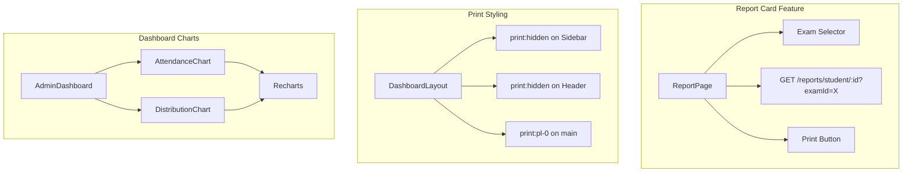

# Report Card View and Admin Dashboard Charts

## Architecture Overview




---

## Task 1: Report Card View

**File:** `client/src/app/(dashboard)/students/[studentId]/report/page.tsx`

### Data Flow

- Extract `studentId` from URL params via `useParams()`
- Fetch available exams first (need endpoint or hardcode initial exam)
- Use `useQuery` to fetch `GET /reports/student/:studentId?examId=X`
- Add exam dropdown selector to switch between exams

### API Response Structure (from [reports.service.ts](server/src/reports/reports.service.ts))

```typescript
{
  student: { id, name, admissionNumber, class },
  academicYear: string,
  exam: string,
  attendance: { present, total, percentage },
  results: [{ subject, score, grade }],
  summary: { total, average }
}
```

### UI Components

- **Container:** White Card with `max-w-4xl mx-auto p-8` mimicking A4 paper
- **Header:** School name with `font-serif`, address, "Terminal Report Card" title
- **Student Info:** Grid with Avatar, Name, Admission No, Class, Academic Year
- **Attendance Summary:** Days Present / Total Days with percentage
- **Grades Table:** Standard HTML table (not DataTable) with Subject, Score, Grade, Remarks columns
- **Footer:** Total Score, Average, Principal's Signature line

---

## Task 2: Print Styling

### Layout Updates ([layout.tsx](client/src/app/(dashboard)/layout.tsx))

Add print classes to hide navigation when printing:

```typescript
// Sidebar aside element
<aside className="hidden md:flex ... print:hidden">

// Main content wrapper - remove padding when sidebar is hidden
<div className="flex-1 md:pl-64 print:pl-0">

// Header component
<Header className="print:hidden" />
```

### Header Component ([header.tsx](client/src/components/header.tsx))

Accept and apply `className` prop with `print:hidden`.

### Report Card Print Classes

```typescript
// Print button
<Button className="print:hidden" onClick={() => window.print()}>

// A4 Card container
<Card className="max-w-4xl mx-auto p-8 print:shadow-none print:border-none print:p-0">
```

---

## Task 3: Admin Dashboard Charts

### Dependencies

Install Recharts: `pnpm add recharts`

### New Components

**1. [components/dashboard/attendance-chart.tsx](client/src/components/dashboard/attendance-chart.tsx)**

- Recharts `BarChart` with `ResponsiveContainer`
- Mock data: `[{ name: 'Mon', present: 45, absent: 5 }, ...]`
- Use CSS variables for colors: `hsl(var(--primary))`, `hsl(var(--destructive))`
- Wrapped in Shadcn Card

**2. [components/dashboard/distribution-chart.tsx](client/src/components/dashboard/distribution-chart.tsx)**

- Recharts `PieChart` with `ResponsiveContainer`
- Mock data: Students per class (Grade 10: 25, Grade 11: 30, etc.)
- Use CSS variables for segment colors
- Wrapped in Shadcn Card

### Dashboard Layout Update ([dashboard/page.tsx](client/src/app/(dashboard)/dashboard/page.tsx))

Add charts in a 2-column grid below existing stat cards:

```typescript
{/* Charts Section */}
<div className="grid gap-4 md:grid-cols-2">
  <AttendanceChart />
  <DistributionChart />
</div>
```

---

## Files to Create/Modify


| Action | File                                                              |
| ------ | ----------------------------------------------------------------- |
| Create | `client/src/app/(dashboard)/students/[studentId]/report/page.tsx` |
| Modify | `client/src/app/(dashboard)/layout.tsx`                           |
| Modify | `client/src/components/header.tsx`                                |
| Create | `client/src/components/dashboard/attendance-chart.tsx`            |
| Create | `client/src/components/dashboard/distribution-chart.tsx`          |
| Modify | `client/src/app/(dashboard)/dashboard/page.tsx`                   |


