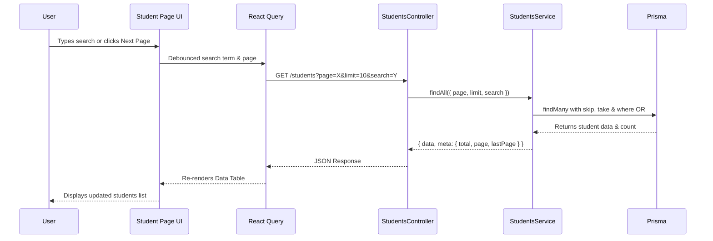

# Implement Server-Side Pagination for Students Directory

This plan outlines the required changes to implement server-side pagination for the `StudentsController` and `StudentsService`, as well as creating the frontend data table UI.

## Architecture & Data Flow

## 1. Dependency Installation

- Install required packages on the frontend: `@tanstack/react-table` and `@tanstack/react-query`.

## 2. Backend Updates

`**[server/src/students/students.service.ts](server/src/students/students.service.ts)**`

- Modify `findAll` to accept `page`, `limit`, and `search` in the `filters` argument.
- Calculate `skip` using `(page - 1) * limit`.
- Expand the `whereClause` to include a case-insensitive `OR` filter when `search` is provided, targeting:
  - `profile.firstName`
  - `profile.lastName`
  - `studentRecord.admissionNumber`
- Use `this.prisma.user.findMany` with `skip`, `take`, and the required `include` options.
- Use `this.prisma.user.count` to calculate the total number of records.
- Return the response wrapped in `{ data, meta: { total, page, lastPage } }`.

`**[server/src/students/students.controller.ts](server/src/students/students.controller.ts)**`

- Add `@Query('page')`, `@Query('limit')`, and `@Query('search')` to the `findAll` route method.
- Parse the integer arguments and pass them down to `this.studentsService.findAll()`.

## 3. Frontend Updates

`**[client/src/components/students/columns.tsx](client/src/components/students/columns.tsx)**`

- Define the columns using `@tanstack/react-table`:
  - **Avatar**: `profile.avatarUrl` or fallback initials using Shadcn Avatar.
  - **Name**: `profile.firstName + ' ' + profile.lastName`.
  - **Admission No**: `studentRecord.admissionNumber`.
  - **Class**: `studentRecord.currentSection.name`.
  - **Status**: Render a styled Badge component (Green for Active, Red for Inactive).
  - **Actions**: A dropdown menu component with View, Edit, and Delete actions.

`**[client/src/components/students/data-table.tsx](client/src/components/students/data-table.tsx)`**

- Implement a generic `DataTable` wrapping Shadcn UI's `<Table>` components.
- Accept `columns` and `data` as props.
- Ensure all pagination logic is deferred to the parent; do **not** use the table's internal pagination features.

`**[client/src/app/(dashboard)/students/page.tsx](client/src/app/(dashboard)/students/page.tsx)`**

- Setup state for `page` (number, default 1) and `search` (string, default "").
- Implement a custom `useDebounce` hook (or use an external one) to debounce the `search` input value.
- Use `useQuery` from `@tanstack/react-query`:
  - Query Key: `['students', page, debouncedSearch]`
  - Query Function: `axios.get('/students', { params: { page, limit: 10, search: debouncedSearch } })`
  - Option: `placeholderData: keepPreviousData` (to avoid UI flashes during pagination).
- Create the layout:
  - Header title and "Add Student" Link button.
  - Search input bound to the `search` state.
  - Render a loading state using Shadcn `Skeleton` when `isLoading` is true.
  - Render the `DataTable` passing the fetched `.data.data` and the defined `columns`.
  - Render pagination controls ("Previous", "Next") utilizing `.data.meta.lastPage` to disable the "Next" button and `page === 1` to disable the "Previous" button.

