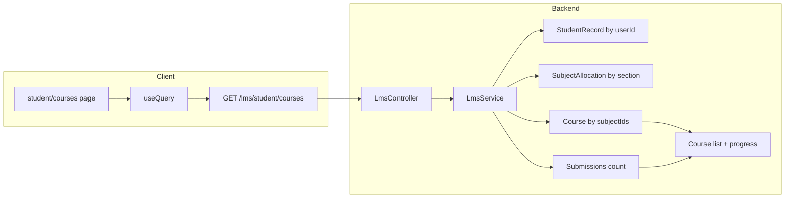

# Student LMS Catalog Page

## Current state

- **Backend**: [server/src/lms/lms.controller.ts](server/src/lms/lms.controller.ts) exposes `GET /lms/courses` (all tenant courses). There is **no endpoint** that returns courses filtered by the logged-in student's enrolled subjects/classes.
- **Data model**: Student → `StudentRecord` (by `userId`) → `currentSectionId` → `Section`. Section has `SubjectAllocation[]` (each has `subjectId`). `Course` has `subjectId`. So "student's courses" = courses whose `subjectId` is in the set of subjects allocated to the student's current section.
- **Progress**: `Submission` links `studentId` and `assignmentId`. There is no lesson-completion model. Progress will be **assignment-based**: completed = count of this student's submissions for assignments in that course; total = count of assignments in that course.
- **Client**: Student dashboard at [client/src/app/(dashboard)/student/dashboard/page.tsx](client/src/app/(dashboard)/student/dashboard/page.tsx) uses `RoleGuard`, `useAuth`, `useQuery`, `axios`, and shadcn `Card` / `Progress`. Student nav is in [client/src/components/sidebar.tsx](client/src/components/sidebar.tsx) (`studentNavigation`); no "Courses" link yet.
- **UI**: [client/src/components/ui/card.tsx](client/src/components/ui/card.tsx) and [client/src/components/ui/progress.tsx](client/src/components/ui/progress.tsx) exist. Progress accepts `value` (0–100).

---

## 1. Backend: Student courses endpoint

**Goal:** Return courses relevant to the logged-in student (by section’s subjects) with optional progress.

- **LmsService** ([server/src/lms/lms.service.ts](server/src/lms/lms.service.ts)):
  - Add `getCoursesForStudent(studentUserId: string)`:
    - Resolve `StudentRecord` by `userId: studentUserId` (tenant extension applies). If none, throw `NotFoundException('Student record not found')`.
    - Load section’s subject IDs: `SubjectAllocation.findMany({ where: { sectionId: studentRecord.currentSectionId } })` → `subjectIds`.
    - If `subjectIds` is empty, return `[]`.
    - `Course.findMany({ where: { subjectId: { in: subjectIds } }, include: { subject: true, teacher: { include: { profile: true } }, modules: { include: { assignments: true } } } })` (tenant extension scopes by school).
    - For each course, compute progress: `totalAssignments` = sum of `assignments.length` over modules; `completedAssignments` = count of `Submission` where `studentId === studentRecord.id` and `assignmentId` in the set of those assignment IDs.
    - Return array of `{ ...course, progress: { totalAssignments, completedAssignments } }` (or equivalent shape with teacher name for convenience).
- **LmsController** ([server/src/lms/lms.controller.ts](server/src/lms/lms.controller.ts)):
  - Add `GET lms/student/courses`:
    - Guard: `@Roles(UserRole.STUDENT)`.
    - Handler: `getStudentCourses(@Request() req: { user: { sub: string } })` → `lmsService.getCoursesForStudent(req.user.sub)`.
  - Route must be registered **before** `GET courses/:id` to avoid "student" being parsed as `:id` (e.g. define `@Get('student/courses')` or a dedicated nested controller; Nest order is declaration order, so `@Get('student/courses')` before `@Get('courses/:id')`).

---

## 2. Frontend: Catalog page

- **New page**: [client/src/app/(dashboard)/student/courses/page.tsx](client/src/app/(dashboard)/student/courses/page.tsx)
  - Client component; wrap content in `<RoleGuard allowedRoles={["STUDENT"]}>`.
  - Use `useAuth()` for `user`; `useQuery` with `queryKey: ['lms', 'student', 'courses', user?.id]`, `queryFn`: `axios.get('/lms/student/courses')` (or the exact path chosen in step 1), `enabled: !!user?.id`.
  - Loading: skeleton grid (e.g. 3–4 card-shaped skeletons).
  - Empty: message like "No courses assigned to your class yet."
  - Data: render a responsive **grid** (e.g. `grid grid-cols-1 md:grid-cols-2 lg:grid-cols-3 gap-4`) of shadcn **Card** components. Each card:
    - **CardTitle**: course name (e.g. `course.name`).
    - **CardDescription** (or a short paragraph): short description (e.g. `course.description` truncated) and teacher name (e.g. `course.teacher?.profile` → `firstName lastName`; fallback if no teacher).
    - **Progress** (optional but recommended): `value = totalAssignments ? (completedAssignments / totalAssignments) * 100 : 0`; show a short label like "X of Y assignments" if desired.
    - **CardFooter** (or CardContent): **Button** or **Link** "Go to Course" → `href="/student/courses/[courseId]"` (use Next.js `Link` and the course `id`).
  - Typed response: define a small type for the API response (course + progress + subject + teacher profile) and use it for the query.

---

## 3. Sidebar: Courses link for students

- In [client/src/components/sidebar.tsx](client/src/components/sidebar.tsx), add an entry to `studentNavigation` (e.g. after "My Grades" or "Attendance"):
  - `name: "My Courses"` (or "Courses"), `href: "/student/courses"`, `icon`: e.g. `BookOpen` from `lucide-react` (already used on student dashboard).

---

## 4. Optional: Course detail placeholder

- The "Go to Course" link targets `/student/courses/[courseId]`. If that page does not exist yet, either add a minimal placeholder page at `client/src/app/(dashboard)/student/courses/[courseId]/page.tsx` that shows "Course detail" and the `courseId`, or note in the plan that the link is ready and the detail page can be implemented later. (Plan can leave this as a one-line note.)

---

## Data flow

---

## File summary

| Action | File                                                                                                                                                                                                         |
| ------ | ------------------------------------------------------------------------------------------------------------------------------------------------------------------------------------------------------------ |
| Edit   | [server/src/lms/lms.service.ts](server/src/lms/lms.service.ts) — add `getCoursesForStudent(studentUserId)` with section → subjectIds → courses + progress                                                    |
| Edit   | [server/src/lms/lms.controller.ts](server/src/lms/lms.controller.ts) — add `GET student/courses` (before `courses/:id`), STUDENT only, call service with `req.user.sub`                                      |
| Create | [client/src/app/(dashboard)/student/courses/page.tsx](client/src/app/(dashboard)/student/courses/page.tsx) — RoleGuard, useQuery, grid of Cards (title, teacher, description, Progress, "Go to Course" link) |
| Edit   | [client/src/components/sidebar.tsx](client/src/components/sidebar.tsx) — add "My Courses" / "Courses" to `studentNavigation`                                                                                 |

If `/student/courses/[courseId]` is not implemented, add a minimal placeholder or document that the link is prepared for a future detail page.