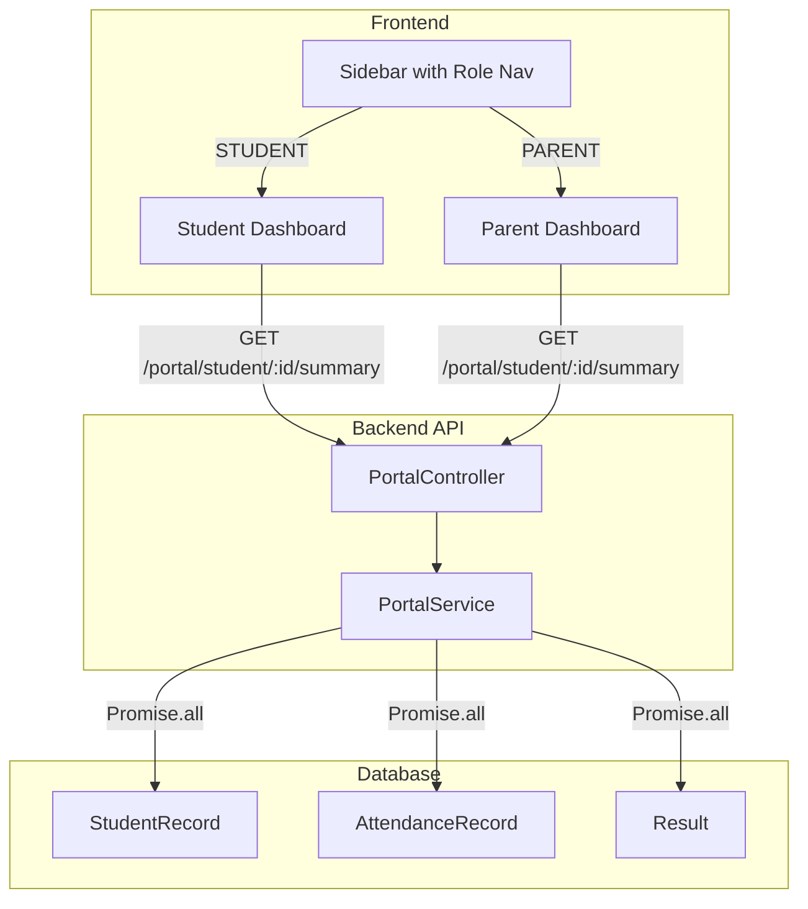

# Student Portal Dashboard Implementation

This plan implements a complete Student Portal with backend aggregation, role-based frontend navigation, and dashboard UI for students and parents.

## Architecture Overview




## Prerequisites

- Install Shadcn `progress` component for the attendance widget

## Part 1: Backend - Portal Module

### 1.1 Create Portal Module Structure

Create files manually (NestJS resource generator may not work in all environments):

- `server/src/portal/portal.module.ts`
- `server/src/portal/portal.service.ts`
- `server/src/portal/portal.controller.ts`

### 1.2 Portal Service (`server/src/portal/portal.service.ts`)

**Method:** `getStudentDashboard(studentUserId: string)`

Run these queries in parallel via `Promise.all`:

1. **Fetch StudentRecord** with relations:
  - Include `user.profile` for name
  - Include `currentSection` with `class` for class/section info
2. **Calculate Attendance Percentage** for current month:
  - Query `AttendanceRecord` where `date` is within current month
  - Count total records and PRESENT records
  - Calculate percentage: `(presentCount / totalCount) * 100`
3. **Fetch Latest 5 Results**:
  - Query `Result` ordered by `createdAt DESC`, limit 5
  - Include `subject` and `exam` relations
4. **Get Today's Attendance Status**:
  - Query `AttendanceRecord` for today's date
  - Return status or null if not marked

**Return Type** (flat structure):

```typescript
{
  studentId: string;
  firstName: string;
  lastName: string;
  email: string;
  admissionNumber: string;
  className: string;
  sectionName: string;
  attendancePercentage: number;
  totalAttendanceDays: number;
  presentDays: number;
  todayStatus: 'PRESENT' | 'ABSENT' | 'LATE' | 'EXCUSED' | null;
  recentGrades: Array<{
    subjectName: string;
    examName: string;
    score: number;
    grade: string;
    date: string;
  }>;
}
```

### 1.3 Portal Controller (`server/src/portal/portal.controller.ts`)

**Route:** `GET /portal/student/:studentId/summary`

- Guards: `@UseGuards(AuthGuard('jwt'), RolesGuard)`
- Roles: `@Roles(UserRole.STUDENT, UserRole.PARENT, UserRole.ADMIN, UserRole.SUPER_ADMIN)`
- Security check in method body:
  - If `req.user.role === STUDENT`: verify `req.user.sub === studentId`
  - If `req.user.role === PARENT`: query `StudentRecord` to verify `parentId === req.user.sub`
  - Throw `ForbiddenException` if checks fail

### 1.4 Register Module

Update `[server/src/app.module.ts](server/src/app.module.ts)` to import `PortalModule`.

## Part 2: Frontend - Role-Based Navigation

### 2.1 Update Sidebar (`client/src/components/sidebar.tsx`)

Add navigation arrays for STUDENT and PARENT roles:

**Student Navigation:**

- "My Dashboard" (`/student/dashboard`) - LayoutDashboard icon
- "My Grades" (`/student/grades`) - Award icon
- "Attendance" (`/student/attendance`) - CalendarCheck icon

**Parent Navigation:**

- "My Children" (`/parent/dashboard`) - Users icon
- "Fees/Billing" (`/parent/billing`) - CreditCard icon (placeholder)

Update navigation selection logic:

```typescript
const getNavigation = (role: string | undefined) => {
  switch (role) {
    case 'TEACHER': return teacherNavigation;
    case 'STUDENT': return studentNavigation;
    case 'PARENT': return parentNavigation;
    default: return adminNavigation;
  }
};
```

### 2.2 Update Header Mobile Menu

Update `[client/src/components/header.tsx](client/src/components/header.tsx)` to use the same role-based navigation logic for the mobile menu.

## Part 3: Frontend - Student Dashboard Page

### 3.1 Create Page Structure

**File:** `client/src/app/(dashboard)/student/dashboard/page.tsx`

### 3.2 Data Fetching

- Use `useAuth()` to get `user.id` as `studentId`
- Use `useQuery` with key `['portal', 'student', studentId]`
- Fetch from `GET /portal/student/:studentId/summary`

### 3.3 UI Components

**Welcome Banner (Card):**

- Large greeting: "Welcome back, {firstName}!"
- Subtext: Current class and section

**Attendance Widget (Card):**

- Shadcn `Progress` component showing monthly percentage
- Color coding via Tailwind:
  - `>= 90%`: green (`bg-green-500`)
  - `75-89%`: default
  - `< 75%`: red (`bg-red-500`)
- Text showing "Today's Status: {status}" or "Not marked yet"

**Recent Grades Widget (Card):**

- List of 5 most recent results
- Each item shows: Subject, Score, Grade (as Badge)
- Empty state: BookOpen icon + "No exams recorded yet"

**Layout:**

- Responsive grid: `grid-cols-1 md:grid-cols-2` for widgets
- Welcome banner spans full width

## Part 4: Frontend - Parent Dashboard Page

### 4.1 Create Page Structure

**File:** `client/src/app/(dashboard)/parent/dashboard/page.tsx`

### 4.2 Implementation

- Fetch children linked to the parent (requires backend endpoint or use existing data)
- Display cards for each child with summary info
- Link to detailed view using student dashboard endpoint

## Part 5: Access Control

### 5.1 Role-Based Route Protection

Create a wrapper component or add checks to protected pages:

**Option A:** Add role check at page level:

```typescript
const { user } = useAuth();
if (user?.role !== 'STUDENT') {
  router.push('/dashboard');
  return null;
}
```

**Option B:** Create `RoleGuard` component that wraps pages and redirects unauthorized users.

### 5.2 Pages to Protect

- `/teacher/`* - Only TEACHER role
- `/student/`* - Only STUDENT role
- `/parent/*` - Only PARENT role
- Admin pages (`/students`, `/dashboard/teachers`, etc.) - Only ADMIN/SUPER_ADMIN

