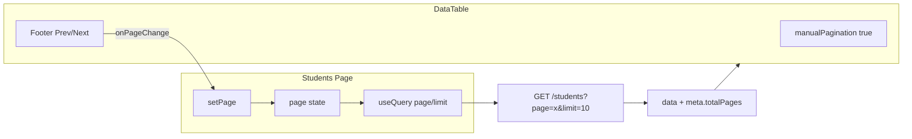

# Students Server-Side Pagination Refactor

## Current state

- **Backend** ([server/src/students/students.service.ts](server/src/students/students.service.ts)): Returns `{ data, meta: { total, page, limit, totalPages } }` per [PaginatedResult](server/src/common/interfaces/paginated-result.interface.ts).
- **Students page** ([client/src/app/(dashboard)/students/page.tsx](client/src/app/(dashboard)/students/page.tsx)): Already fetches with `page` and `limit` query params. Uses `meta.lastPage` but the backend returns `meta.totalPages` — mismatch.
- **DataTable** ([client/src/components/students/data-table.tsx](client/src/components/students/data-table.tsx)): Simple table with `getCoreRowModel()` only. No pagination config. Pagination buttons are rendered in the page component, outside the table.

---

## 1. Update Students page: meta shape and DataTable props

In [client/src/app/(dashboard)/students/page.tsx](client/src/app/(dashboard)/students/page.tsx):

- Replace `StudentsResponse` interface to match backend:

```ts
  interface StudentsResponse {
    data: Student[];
    meta: {
      total: number;
      page: number;
      limit: number;
      totalPages: number;
    };
  }
  

```

- Replace `meta.lastPage` with `meta.totalPages` everywhere it is used.
- Pass pagination props to `DataTable`:

```tsx
  <DataTable
    columns={columns}
    data={students}
    page={page}
    pageCount={meta?.totalPages ?? 0}
    onPageChange={setPage}
    isLoading={isLoading}
  />
  

```

- Remove the external pagination div (lines 132–154). Pagination will live inside the DataTable footer.

---

## 2. Update DataTable: manual pagination and footer

In [client/src/components/students/data-table.tsx](client/src/components/students/data-table.tsx):

- Extend props:

```ts
  interface DataTableProps<TData, TValue> {
    columns: ColumnDef<TData, TValue>[];
    data: TData[];
    page?: number;
    pageCount?: number;
    onPageChange?: (page: number) => void;
    isLoading?: boolean;
  }
  

```

- Configure `useReactTable` with:
  - `manualPagination: true` when `pageCount` is provided
  - `pageCount: pageCount ?? -1` (use -1 when not paginated to avoid assumptions)
  - `state: { pagination: { pageIndex: (page ?? 1) - 1, pageSize: 10 } }` when pagination props exist (TanStack uses 0-based pageIndex)
  - `onPaginationChange: (updater) => { ... }` to call `onPageChange(newPageIndex + 1)` when the user changes page
- Add `TableFooter` with `TableRow` and `TableCell` containing:
  - "Previous" button: disabled when `page === 1` or `isLoading`, calls `onPageChange(page - 1)`
  - "Next" button: disabled when `page >= pageCount` or `isLoading`, calls `onPageChange(page + 1)`
  - Page indicator: `Page {page} of {pageCount}` (only when `pageCount > 1`)
- Render the footer only when `pageCount` is defined and `pageCount > 1`.

---

## 3. Data flow




---

## File summary


| Action | File                                                                                                                                                                             |
| ------ | -------------------------------------------------------------------------------------------------------------------------------------------------------------------------------- |
| Edit   | [client/src/app/(dashboard)/students/page.tsx](client/src/app/(dashboard)/students/page.tsx) — use totalPages, pass pagination props to DataTable, remove external pagination UI |
| Edit   | [client/src/components/students/data-table.tsx](client/src/components/students/data-table.tsx) — add pagination props, manualPagination, pageCount, table footer with Prev/Next  |


