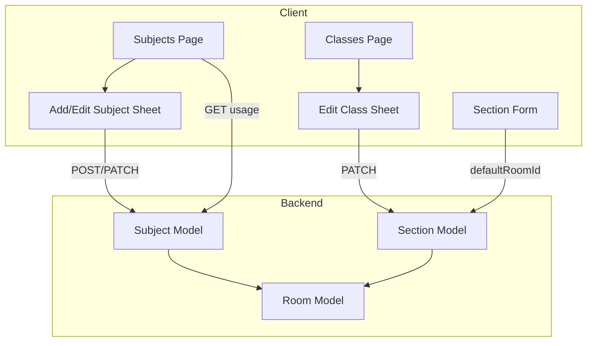

# Subjects & Classes Enhancements Plan

Add features from [my-timetable-app](https://github.com/incredibleHeck/my-timetable-app) to project-lanita's subjects and classes: subject color, exam flags, room requirements, edit/delete UI with usage stats, and section default room.

---

## Phase 1: Schema and Backend

### 1.1 Subject model changes

Add to `[server/prisma/schema.prisma](server/prisma/schema.prisma)` Subject model:

```prisma
color           String    @default("#6366f1")  // Hex for UI/timetable
isExaminable    Boolean   @default(true)        // Include in exam timetable
isSingleResource Boolean @default(false)       // Only one class school-wide per period (e.g. ICT Lab)
requiredRoomId  String?   @db.Uuid             // Fixed room requirement
requiredRoomType RoomType?                     // Room type requirement
preferredRoomIds Json?     // Array of room IDs for scheduling preference
```

- Add `requiredRoom` relation to Room (optional)
- Add `RoomType` import if needed
- Migration: `npx prisma migrate dev --name add_subject_scheduling_fields`

### 1.2 Section model changes

Add to Section model:

```prisma
defaultRoom   Room?   @relation(fields: [defaultRoomId], references: [id])
defaultRoomId String? @db.Uuid
```

- Add `defaultSections Section[]` to Room model
- Migration: `npx prisma migrate dev --name add_section_default_room`

### 1.3 DTOs and services

- **CreateSubjectDto** (`[server/src/subjects/dto/create-subject.dto.ts](server/src/subjects/dto/create-subject.dto.ts)`): Add optional `color`, `isExaminable`, `isSingleResource`, `requiredRoomId`, `requiredRoomType`, `preferredRoomIds` (string array validated)
- **CreateSectionDto** (`[server/src/sections/dto/create-section.dto.ts](server/src/sections/dto/create-section.dto.ts)`): Add optional `defaultRoomId`
- **SubjectsService**: Update `create`/`update` to handle new fields; add `getSubjectUsage(id)` returning `{ classCount, teacherCount }` via allocations
- **SectionsService**: Include `defaultRoom` in findOne/findAll when needed; update create/update for `defaultRoomId`

---

## Phase 2: Subject UI

### 2.1 Subject constants and types

- Create `[client/src/lib/subject-colors.ts](client/src/lib/subject-colors.ts)`: Export `SUBJECT_COLOR_PALETTE` (subset of my-timetable-app palette, ~20 colors) and `DEFAULT_SUBJECT_COLOR`

### 2.2 Add/Edit subject sheet

- Refactor `[client/src/components/subjects/add-subject-sheet.tsx](client/src/components/subjects/add-subject-sheet.tsx)` to support both Add and Edit:
  - Accept optional `subject` prop; when present, prefill and call PATCH instead of POST
  - Add color picker (grid of palette colors, avoid duplicates)
  - Add toggles: `isExaminable`, `isSingleResource`
  - Add optional "Fixed room" select (fetch rooms from `/timetable/rooms`)
  - Add optional "Required room type" select (CLASSROOM, LAB, HALL, etc.)
  - Rename or keep as `AddSubjectSheet` but add `EditSubjectSheet` variant or `subject?: Subject` prop

### 2.3 Subjects page

- Update `[client/src/app/(dashboard)/dashboard/subjects/page.tsx](client/src/app/(dashboard)`/dashboard/subjects/page.tsx):
  - Switch from table to card layout (like my-timetable-app) or keep table and add Actions column
  - Show color swatch + name, code, type, usage stats (class count, teacher count)
  - Add Edit button (opens sheet with subject data)
  - Add Delete button with confirmation dialog; show warning if subject has allocations
  - Add usage stats: call new endpoint `GET /subjects/:id/usage` or include in `findOne` response

### 2.4 Subject usage API

- Add `GET /subjects/:id/usage` in `[server/src/subjects/subjects.controller.ts](server/src/subjects/subjects.controller.ts)` returning `{ classCount, teacherCount }`, or include in `findOne` via a separate service method. Prefer including in findAll for efficiency (single query with _count).

---

## Phase 3: Class and Section UI

### 3.1 Edit/Delete class

- Create `[client/src/components/classes/edit-class-sheet.tsx](client/src/components/classes/edit-class-sheet.tsx)`: Same form as AddClassSheet, prefill from `class`, call PATCH
- Add delete confirmation dialog component or inline in page
- Update `[client/src/app/(dashboard)/dashboard/classes/page.tsx](client/src/app/(dashboard)`/dashboard/classes/page.tsx):
  - Add Edit and Delete actions per class card
  - Delete: confirm, then `DELETE /classes/:id`; handle sections/allocations (backend may cascade or block)

### 3.2 Section default room

- Update `[client/src/components/classes/add-class-sheet.tsx](client/src/components/classes/add-class-sheet.tsx)`: Sections are created separately; check if sections are created from class flow
- Create or update section form to include optional "Default room" select (fetch from `/timetable/rooms`)
- In classes page section cards: show default room name if set; add Edit section action to set default room

### 3.3 Section edit flow

- Add Edit Section sheet/dialog: name, capacity, defaultRoomId
- Ensure sections API supports PATCH with `defaultRoomId`; DTO already extended in Phase 1

---

## Phase 4: Polish

- Seed or migration: Set default `color` for existing subjects (round-robin from palette)
- Ensure timetable views use subject `color` when rendering (if applicable)
- Add `isExaminable` to exam timetable generation logic (future hook)
- Add `isSingleResource` and `requiredRoomId` to timetable solver (future hook)

---

## Data flow




---

## Files to create


| File                                                                       | Purpose                                    |
| -------------------------------------------------------------------------- | ------------------------------------------ |
| `client/src/lib/subject-colors.ts`                                         | Color palette and default                  |
| `client/src/components/subjects/edit-subject-sheet.tsx`                    | Edit subject (or extend add-subject-sheet) |
| `client/src/components/classes/edit-class-sheet.tsx`                       | Edit class                                 |
| `client/src/components/subjects/delete-subject-dialog.tsx`                 | Delete confirmation                        |
| `client/src/components/classes/delete-class-dialog.tsx`                    | Delete confirmation                        |
| `server/prisma/migrations/..._add_subject_scheduling_fields/migration.sql` | Subject migration                          |
| `server/prisma/migrations/..._add_section_default_room/migration.sql`      | Section migration                          |


---

## Files to modify


| File                                                     | Changes                                       |
| -------------------------------------------------------- | --------------------------------------------- |
| `server/prisma/schema.prisma`                            | Subject + Section fields, Room relation       |
| `server/src/subjects/dto/create-subject.dto.ts`          | New optional fields                           |
| `server/src/subjects/subjects.service.ts`                | Handle new fields, getSubjectUsage            |
| `server/src/sections/dto/create-section.dto.ts`          | defaultRoomId                                 |
| `server/src/sections/sections.service.ts`                | defaultRoomId, include defaultRoom            |
| `client/src/components/subjects/add-subject-sheet.tsx`   | Color, toggles, room selects, edit mode       |
| `client/src/app/(dashboard)/dashboard/subjects/page.tsx` | Cards/table with edit, delete, usage          |
| `client/src/app/(dashboard)/dashboard/classes/page.tsx`  | Edit, delete, section default room            |
| `client/src/components/classes/add-class-sheet.tsx`      | If sections created inline, add defaultRoomId |


---

## Out of scope (future)

- Joint classes, elective blocks
- Class-specific period structure (duration, breaks)
- Curriculum per class (periodsPerWeek, singles, doubles) — project-lanita uses Subject.periodsPerWeek and SubjectAllocation
- Duplicate class
- Class groups / assignments panel

