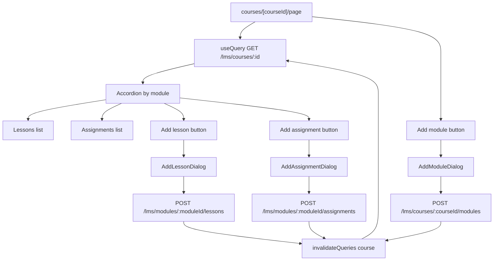

# Teacher Course Detail Page and LMS Dialogs

## Current state

- **Server:** [server/src/lms/lms.controller.ts](server/src/lms/lms.controller.ts) exposes:
  - `GET /lms/courses/:id` — returns course with `subject`, `teacher`, and `modules` (each module includes `lessons` ordered by `orderIndex`, and `assignments`). Use this for the detail page.
  - `POST /lms/courses/:courseId/modules` — create module (body: `title`, `description?`, `order?`).
  - `POST /lms/modules/:moduleId/lessons` — create lesson (body: `title`, `content?`, `order?`).
  - `POST /lms/modules/:moduleId/assignments` — create assignment (body: `title`, `description?`, `dueDate?`, `maxScore?`).
- **Client:** Uses `api` from [client/src/lib/axios.ts](client/src/lib/axios.ts) (auth + baseURL). Data fetching: `useQuery` / `useMutation` from TanStack Query; forms: `react-hook-form` + `zod` + [client/src/components/ui/form.tsx](client/src/components/ui/form.tsx). Dialogs: [client/src/components/ui/dialog.tsx](client/src/components/ui/dialog.tsx). No Accordion in `client/src/components/ui` yet; `@radix-ui/react-accordion` is available via the `radix-ui` dependency (see lockfile).
- **Teacher area:** [client/src/app/(dashboard)/teacher/classes/page.tsx](client/src/app/(dashboard)/teacher/classes/page.tsx) uses `RoleGuard`, `useAuth`, and `api.get(...)`; no existing `teacher/courses` route.

## 1. Add shadcn-style Accordion component

- Add [client/src/components/ui/accordion.tsx](client/src/components/ui/accordion.tsx) using Radix Accordion primitives (from `radix-ui` or install `@radix-ui/react-accordion` if the umbrella package does not export it). Standard shadcn pattern: `Accordion`, `AccordionItem`, `AccordionTrigger`, `AccordionContent` with styling consistent with existing UI (e.g. `cn()`, border, padding). This will be used to render one accordion item per `CourseModule`.

## 2. Course detail page

- **Path:** [client/src/app/(dashboard)/teacher/courses/[courseId]/page.tsx](client/src/app/(dashboard)/teacher/courses/[courseId]/page.tsx).
- **Auth/layout:** Wrap content in `RoleGuard` with `allowedRoles={["TEACHER", "ADMIN", "SUPER_ADMIN"]}` (same as teacher classes page). Use `useParams()` to read `courseId`.
- **Data fetch:** `useQuery` with `queryKey: ["lms", "course", courseId]` and `queryFn: () => api.get(\`/lms/courses/${courseId}).then(res => res.data)`. Handle loading (skeleton) and error (message or redirect). Type the response to match the server shape: course with` modules`(array of`{ id, title, description, order, lessons: Array<{ id, title, content, orderIndex }>, assignments: Array<{ id, title, description, dueDate, maxScore }> }`), plus` subject`,` teacher`.
- **UI structure:**
  - Page title: course name (and optional breadcrumb/link back to teacher courses list if that page exists).
  - “Add module” control that opens the Add Module dialog (state: `moduleDialogOpen`, set by a button).
  - **Accordion:** Map `course.modules` (optionally sort by `order`) to `AccordionItem`s. Each item:
    - **Trigger:** Module title (and optional short description or lesson/assignment count).
    - **Content:**
      - List of **lessons** (e.g. title + optional content preview or “Lesson” label).
      - List of **assignments** (e.g. title + optional due date / max score).
      - Two actions: “Add lesson” and “Add assignment” — each opens the corresponding dialog, passing the current module’s `id` and `onSuccess` that invalidates the course query so the list refetches.
- **Dialogs:** Use controlled open state. For “Add lesson” and “Add assignment”, store which module is active (e.g. `openLessonModuleId`, `openAssignmentModuleId`) so the correct `moduleId` is sent on submit.

## 3. Add Module dialog

- **Path:** [client/src/components/lms/add-module-dialog.tsx](client/src/components/lms/add-module-dialog.tsx).
- **Props:** `courseId: string`, `open: boolean`, `onOpenChange: (open: boolean) => void`, `onSuccess?: () => void`.
- **Form (zod + react-hook-form):** `title` (required string), `description` (optional string), `order` (optional number, min 0). Match [server CreateModuleDto](server/src/lms/dto/create-module.dto.ts).
- **Submit:** `useMutation` → `api.post(\`/lms/courses/${courseId}/modules, { title, description, order })`. On success: toast,` onOpenChange(false)`,` queryClient.invalidateQueries({ queryKey: ["lms", "course", courseId] })`,` onSuccess?.()`.
- **UI:** Use existing [Dialog](client/src/components/ui/dialog.tsx), [Form](client/src/components/ui/form.tsx), Input/Button; same pattern as [record-payment-dialog.tsx](client/src/components/billing/record-payment-dialog.tsx).

## 4. Add Lesson dialog

- **Path:** [client/src/components/lms/add-lesson-dialog.tsx](client/src/components/lms/add-lesson-dialog.tsx).
- **Props:** `moduleId: string`, `open: boolean`, `onOpenChange: (open: boolean) => void`, `onSuccess?: () => void`.
- **Form:** `title` (required), `content` (optional), `order` (optional number, min 0). Match [CreateLessonDto](server/src/lms/dto/create-lesson.dto.ts) (server maps `order` to `orderIndex`).
- **Submit:** `api.post(\`/lms/modules/${moduleId}/lessons, { title, content, order })`. On success: toast, close dialog, invalidate` ["lms", "course", courseId]`(page must pass`courseId`in`onSuccess`or dialog can accept optional`courseId` and invalidate it).

## 5. Add Assignment dialog

- **Path:** [client/src/components/lms/add-assignment-dialog.tsx](client/src/components/lms/add-assignment-dialog.tsx).
- **Props:** `moduleId: string`, `open: boolean`, `onOpenChange: (open: boolean) => void`, `onSuccess?: () => void`.
- **Form:** `title` (required), `description` (optional), `dueDate` (optional, date string for API), `maxScore` (optional number). Match [CreateAssignmentDto](server/src/lms/dto/create-assignment.dto.ts).
- **Submit:** `api.post(\`/lms/modules/${moduleId}/assignments, { title, description, dueDate, maxScore })`. On success: toast, close dialog, invalidate course query (same as lesson dialog — either pass` courseId` or accept it as optional prop for invalidation).

## 6. Invalidation and dialog placement

- **Course query key:** Use a single key pattern for the detail page, e.g. `["lms", "course", courseId]`. All three dialogs should invalidate this after a successful create so the accordion updates. The Add Lesson and Add Assignment dialogs can receive an optional `courseId` prop to perform `invalidateQueries({ queryKey: ["lms", "course", courseId] })` inside them; otherwise the page can pass an `onSuccess` that calls `refetch()` or invalidates the query.
- **Trigger placement:** “Add module” at page level. “Add lesson” and “Add assignment” inside each module’s accordion content, so each module has its own buttons that set the active `moduleId` and open the corresponding dialog.

## File summary

| Action | File                                                                                                                                                                                     |
| ------ | ---------------------------------------------------------------------------------------------------------------------------------------------------------------------------------------- |
| Add    | [client/src/components/ui/accordion.tsx](client/src/components/ui/accordion.tsx) — Accordion primitives (shadcn-style)                                                                   |
| Add    | [client/src/app/(dashboard)/teacher/courses/[courseId]/page.tsx](client/src/app/(dashboard)/teacher/courses/[courseId]/page.tsx) — detail page, fetch course, accordion, dialog triggers |
| Add    | [client/src/components/lms/add-module-dialog.tsx](client/src/components/lms/add-module-dialog.tsx) — form + POST to `/lms/courses/:courseId/modules`                                     |
| Add    | [client/src/components/lms/add-lesson-dialog.tsx](client/src/components/lms/add-lesson-dialog.tsx) — form + POST to `/lms/modules/:moduleId/lessons`                                     |
| Add    | [client/src/components/lms/add-assignment-dialog.tsx](client/src/components/lms/add-assignment-dialog.tsx) — form + POST to `/lms/modules/:moduleId/assignments`                         |

## Data flow (high level)

No backend changes required; all endpoints and DTOs already exist.