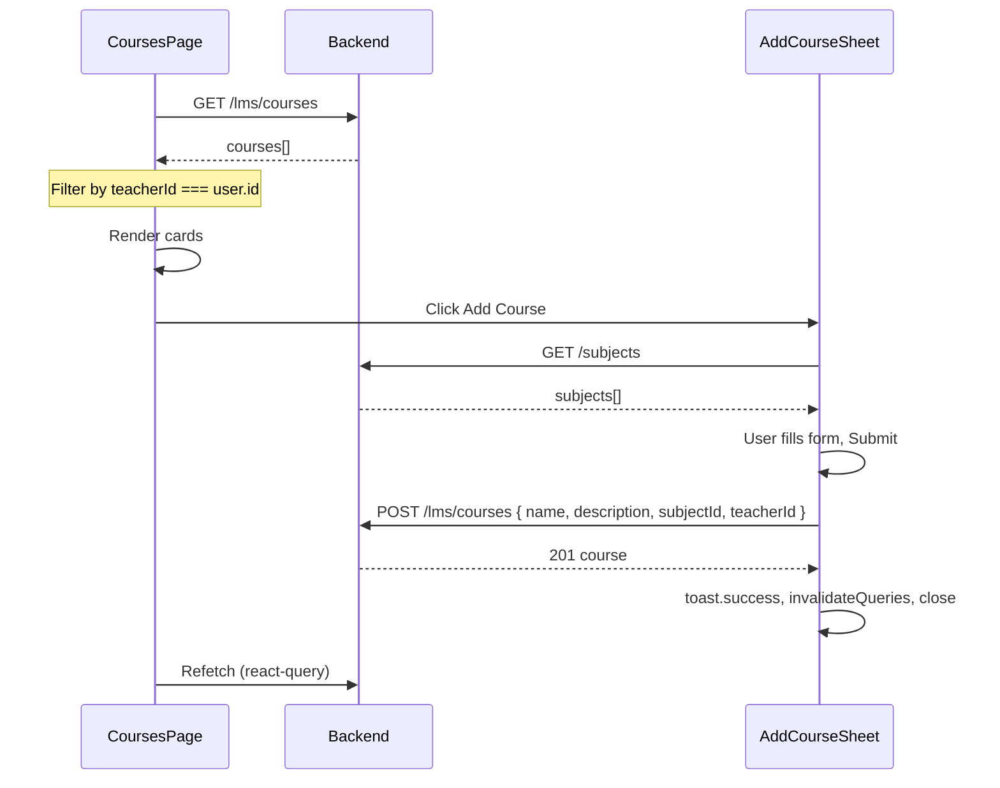

# Teacher Courses Page and Add Course Sheet

## Current state

- **API**: [server/src/lms/lms.controller.ts](server/src/lms/lms.controller.ts) exposes `GET /lms/courses` (no role filter) and `POST /lms/courses` (restricted to `ADMIN`, `SUPER_ADMIN`). Create body uses [CreateCourseDto](server/src/lms/dto/create-course.dto.ts): `name`, optional `code`, optional `description`, `subjectId`, optional `teacherId`, optional `academicYearId`. Prisma Course uses `name` (not `title`).
- **Client**: Teacher area exists ([teacher/classes/page.tsx](client/src/app/(dashboard)/teacher/classes/page.tsx)), uses `RoleGuard`, `useAuth`, `@/lib/axios`, react-query, Card grid, Skeleton. Sheet pattern: [add-class-sheet.tsx](client/src/components/classes/add-class-sheet.tsx) (Sheet + react-hook-form + zod + sonner + useMutation). Toaster is in [app/layout.tsx](client/src/app/layout.tsx). Subjects: `GET /subjects` returns `{ id, name, code, ... }`.

## 1. Courses page – `client/src/app/(dashboard)/teacher/courses/page.tsx`

- **Structure**: Mirror [teacher/classes/page.tsx](client/src/app/(dashboard)/teacher/classes/page.tsx): `RoleGuard` for `TEACHER` (and optionally `ADMIN`, `SUPER_ADMIN`), inner content component using `useAuth()` and `useQuery`.
- **Data**: `queryKey: ["lms", "courses"]`, `queryFn`: `api.get("/lms/courses")` (use default export from `@/lib/axios`). Response is an array of courses (backend returns Prisma result with `subject`, `teacher`, `modules`). Filter client-side by `course.teacherId === user?.id` so the teacher sees only their courses (backend returns all; no `?teacherId=` yet).
- **UI**: Page title "My Courses" and a header row with an "Add Course" trigger that opens the Add Course sheet (no Sheet content on the page itself; the trigger will live in the sheet component or be passed as trigger).
- **Display**: Use a **responsive grid of Cards** (same pattern as teacher classes): each card shows course name, subject name, optional description snippet, and optionally a link/button to course detail (e.g. `/teacher/courses/[id]` later). Use shadcn `Card`, `CardHeader`, `CardTitle`, `CardDescription`, `CardContent`.
- **States**: Loading (Skeleton grid), error (message + retry or simple message), empty (no courses for this teacher – suggest "Add your first course" and show Add trigger).
- **Types**: Define a minimal `Course` type (e.g. `id`, `name`, `code?`, `description?`, `subjectId`, `teacherId?`, `subject: { id, name, code }`, `teacher?`, `modules?`) matching the API response.

## 2. Add Course sheet – `client/src/components/lms/add-course-sheet.tsx`

- **Location**: Create folder `client/src/components/lms/` and file `add-course-sheet.tsx`.
- **Form fields** (user-facing): **Title** (required), **Description** (optional), **Subject** (required, dropdown). Map "Title" to API `name` in the POST body.
- **Components**: shadcn `Sheet`, `SheetContent`, `SheetHeader`, `SheetTitle`; `Form`, `FormField`, `FormControl`, `FormItem`, `FormLabel`, `FormMessage`; `Input` for title and description (description can be `<Input>` or `<textarea>` if available); shadcn `Select` for subject (options from `GET /subjects`); `Button` for submit.
- **Validation**: zod schema: `title` (string min 1), `description` (optional string), `subjectId` (UUID). Use `react-hook-form` + `zodResolver`.
- **Submit**: POST `/lms/courses` with body: `{ name: values.title, description: values.description ?? undefined, subjectId: values.subjectId, teacherId: user?.id }` so the created course is assigned to the current teacher. Use `useMutation`; on success: `toast.success("Course created")`, reset form, close sheet, `queryClient.invalidateQueries({ queryKey: ["lms", "courses"] })`. On error: `toast.error(message)` using `error?.response?.data?.message` or fallback.
- **Trigger**: Support both internal trigger (e.g. "Add Course" button with Plus icon) and optional external trigger via props so the page can render the sheet and put the trigger in the header. Pattern: either export a sheet that wraps a trigger (like [AddClassSheet](client/src/components/classes/add-class-sheet.tsx)), or accept optional `trigger` prop and render `SheetTrigger` when provided.
- **Subjects**: Fetch with `useQuery({ queryKey: ["subjects"], queryFn: () => api.get("/subjects").then(r => r.data), enabled: open })` so subjects load when the sheet opens. Use shadcn `Select` with `SelectItem` per subject (`value={s.id}`, label e.g. `s.name`).
- **Loading**: Disable submit while `mutation.isPending`; show loading indicator on submit button (e.g. Loader2 icon).

## 3. Integration and UX

- **Page**: On the courses page header, add a button that opens the Add Course sheet. Easiest: use `<AddCourseSheet />` which includes its own trigger ("Add Course" button); no need for controlled open unless you want the empty state to open the sheet automatically (optional).
- **Error handling**: In the sheet mutation `onError`, read `error?.response?.data?.message` and show via `toast.error(...)`. On the page, if `useQuery` fails, show a clear error state (no toast required for initial load; optional retry button).
- **Success**: Only in the sheet: `toast.success("Course created successfully")` after successful POST.

## 4. Backend note (optional change)

- **Roles**: [lms.controller.ts](server/src/lms/lms.controller.ts) line 33: `@Roles(UserRole.ADMIN, UserRole.SUPER_ADMIN)` on `create()`. If teachers should be able to create courses, add `UserRole.TEACHER` to the decorator so the POST succeeds for the teacher dashboard.

## File summary

| Action   | File                                                                                                                |
| -------- | ------------------------------------------------------------------------------------------------------------------- |
| Create   | `client/src/app/(dashboard)/teacher/courses/page.tsx` – courses list + filter by teacherId + Add trigger            |
| Create   | `client/src/components/lms/add-course-sheet.tsx` – Sheet, form (title → name, description, subjectId), POST, toasts |
| Optional | `server/src/lms/lms.controller.ts` – add `UserRole.TEACHER` to `@Roles` for `create()`                              |

## Data flow

No new dependencies; use existing `@/lib/axios`, `sonner`, shadcn Form/Sheet/Input/Button/Select, react-query, zod, react-hook-form.