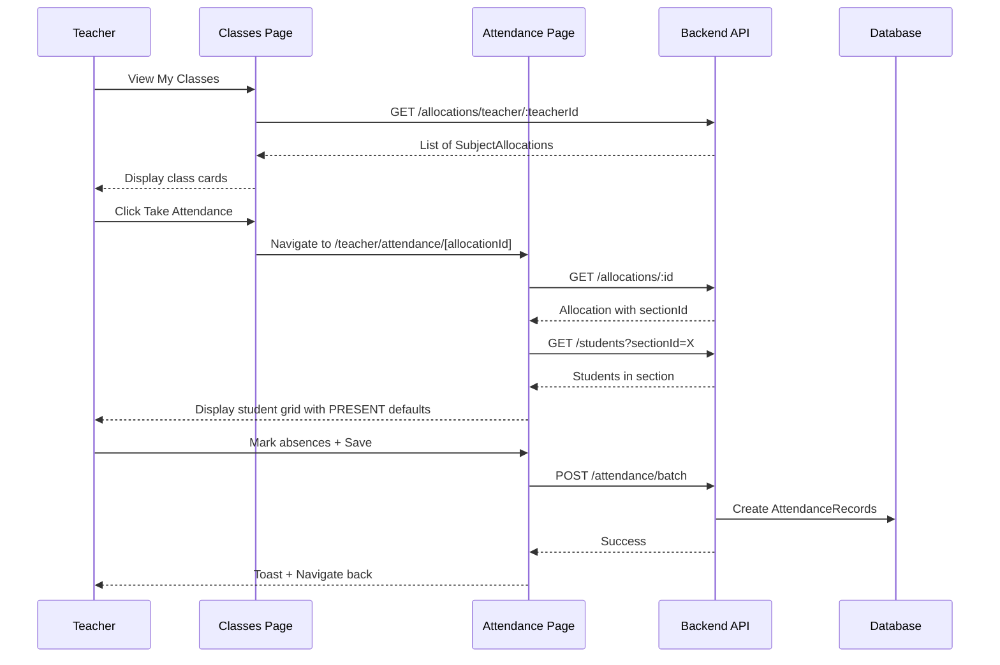

# Teacher Portal: Classes and Attendance

This plan implements the Teacher Portal with a classes listing page and an interactive attendance marking page.

## Architecture & Data Flow

## Prerequisites - Shadcn Components

Install missing Shadcn UI components:

- `calendar` (for date picker)
- `popover` (for date picker wrapper)
- `radio-group` (for attendance status toggles)

## Backend Updates

### 1. Add `GET /allocations/:id` endpoint

**[server/src/allocations/allocations.service.ts](server/src/allocations/allocations.service.ts)**

Add `findOne(id: string)` method that returns the allocation with `section`, `subject`, and `academicYear` relations included.

**[server/src/allocations/allocations.controller.ts](server/src/allocations/allocations.controller.ts)**

Add `GET /:id` route protected by JWT, accessible by TEACHER, ADMIN, SUPER_ADMIN roles.

## Frontend Updates

### 2. Create `useAuth` hook

**[client/src/hooks/use-auth.ts](client/src/hooks/use-auth.ts)**

Create a reusable hook that:

- Reads `user` from localStorage
- Returns `{ user: { id, email, role }, isAuthenticated }`
- Handles SSR safety with `typeof window !== 'undefined'`

### 3. Teacher Classes Page

**[client/src/app/(dashboard)/teacher/classes/page.tsx](client/src/app/(dashboard)/teacher/classes/page.tsx)**

- Use `useAuth` hook to get `user.id` as `teacherId`
- Use `useQuery` with key `['allocations', 'teacher', teacherId]`
- Fetch from `GET /allocations/teacher/:teacherId`
- Display a responsive grid of Shadcn `Card` components:
  - Card title: `{subject.name} - {section.class.name} {section.name}`
  - Badge: `{academicYear.name}`
  - Button: "Take Attendance" linking to `/teacher/attendance/[allocationId]`
- Handle loading state with Skeleton cards
- Handle empty state with `CalendarX` icon and message

### 4. Attendance Marking Page

**[client/src/app/(dashboard)/teacher/attendance/[allocationId]/page.tsx](client/src/app/(dashboard)/teacher/attendance/[allocationId]/page.tsx)**

**State Management:**

- `date`: Date state initialized to `new Date()`, controlled by Popover + Calendar
- `attendanceRecords`: Array of `{ studentId, status, remarks }` initialized when students load

**Data Fetching (2 queries):**

1. `useQuery(['allocation', allocationId])` - fetch `GET /allocations/:allocationId` to get `sectionId`
2. `useQuery(['students', 'section', sectionId])` - fetch `GET /students?sectionId=X` (enabled when sectionId is available)

**UI Layout:**

- Header with page title and date picker (Popover + Calendar)
- Simplified Shadcn `Table` with columns:
  - Avatar (initials fallback)
  - Student Name
  - Admission No
  - Status (RadioGroup)
- RadioGroup options per row: `PRESENT` (green), `ABSENT` (red), `LATE` (yellow), `EXCUSED` (blue)
- Default all students to `PRESENT` on initial load

**Mutation:**

- Use `useMutation` to POST to `/attendance/batch`
- Payload: `{ subjectAllocationId, date: date.toISOString(), records }`
- "Save Register" button shows spinner when `isPending`
- `onSuccess`: Show success toast, navigate to `/teacher/classes`
- `onError`: Show destructive toast with error message

### 5. Update Sidebar Navigation

**[client/src/components/sidebar.tsx](client/src/components/sidebar.tsx)**

Add "My Classes" link for teachers pointing to `/teacher/classes`.